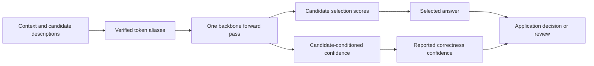
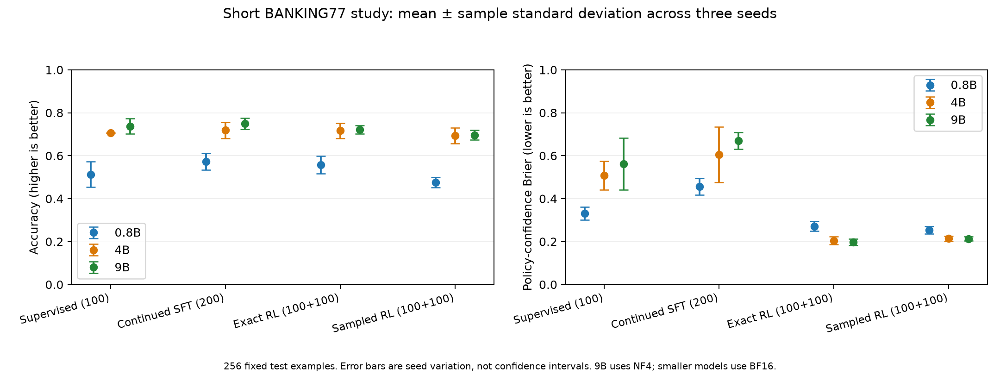

# myJEV: Decision Models, Confidence, and Reinforcement Learning

**Choose an answer. Estimate whether it is right. Know when to ask for review.**

myJEV explores a compact interface for language models: give the model some context and a set of candidate answers, then receive a structured decision in one backbone forward pass. There is no autoregressive answer generation. The project covers data, training objectives, calibration, evaluation, and a local GPU service across **0.8B, 4B, and 9B** models.

This is a research and learning project by [Amit Bahree](https://blog.desigeek.com). The repository will grow through reviewable milestone commits. The first milestone includes working training and inference code, a completed short three-seed pilot, and the measurements needed to question its conclusions.

> **Current milestone: inference pilot.** The 45 scheduled pilot evaluations are complete. Training is deliberately short, and neural evaluation uses 256 held-out test examples. Longer studies are planned. Downloadable trained adapters and a hosted demo are **not released yet**.

[Start here](docs/quickstart.md) · [Documentation](docs/README.md) · [Measured results](docs/experiments.md) · [Roadmap](docs/roadmap.md) · [Model releases](docs/models.md)

## What is a decision model?

Take a support request: **“I was charged twice.”** An application supplies choices such as billing, technical support, and other. myJEV selects one of those choices and returns two different quantities:

| Output | Meaning | How to use it |
|---|---|---|
| Selection scores | Normalized scores over the candidates supplied in this request | Select the highest-scoring candidate |
| Correctness confidence | An estimate that the selected answer is right | Evaluate a threshold for accepting or deferring a decision |

A high selection score is not automatically a reliable probability of correctness. Improving the confidence estimate does not automatically calibrate the entire selection distribution. That distinction is the reason for this project.



## What you can learn and run

- Build a candidate-selection interface using pinned Qwen3.5 backbones and LoRA adapters.
- Compare supervised training, continued supervision, exact expected-reward optimization, and eight-sample REINFORCE.
- Test calibration against temperature scaling and constant-confidence controls.
- Measure accepted-case error and coverage, alongside accuracy, Brier error, and resource use.
- Use the same inference implementation from Python, a CLI, HTTP, or Docker.
- Inspect saved predictions, reproduce charts, and follow what changes at each milestone.

See [architecture and objectives](docs/architecture.md) for the confidence head and reward, and [attribution](docs/attribution.md) for how this implementation relates to JevK5, JevForge, and OpenJev.

## Choose your starting point

| Goal | Start here | Requires |
|---|---|---|
| Understand the design | [Architecture](docs/architecture.md) | No installation |
| Inspect the actual findings | [Experiments and evidence](docs/experiments.md) | No GPU |
| Run the implementation tests | [Install and test](docs/quickstart.md#install-and-test) | Python; no model download |
| Train a first decision model | [Train the 0.8B pilot](docs/quickstart.md#train-the-08b-pilot) | Compatible NVIDIA GPU and backbone download |
| Score or serve your trained artifact | [Python, CLI, and HTTP](docs/quickstart.md#score-and-serve) | A local artifact from training |
| Run a GPU container | [Docker quick start](docs/quickstart.md#docker) | Docker with NVIDIA GPU access |
| Download a trained release | [Model release tracker](docs/models.md) | Planned; no download available yet |

## Three sizes, one experimental interface

| Backbone | Pilot precision | Adaptation | Observed training peak* |
|---|---|---|---:|
| Qwen3.5 0.8B | BF16 | LoRA | 1.7 GiB |
| Qwen3.5 4B | BF16 | LoRA | 8.5 GiB |
| Qwen3.5 9B | NF4 | QLoRA | 12.0 GiB |

\*PyTorch allocated-memory peaks in the initial supervised pilots on 24 GB A30 GPUs. These are not maximum-context serving requirements or minimum GPU recommendations. The 9B precision change also limits conclusions about capacity alone. Configurations pin the backbone revisions; see [hosting measurements](docs/hosting.md).

## What the first pilot found

Mean BANKING77 accuracy across three seeds, on the same fixed 256-example test subset:

| Size | Supervised | Continued supervision | Exact RL | Sampled RL |
|---|---:|---:|---:|---:|
| 0.8B | 51.30% | **57.29%** | 55.73% | 47.53% |
| 4B | 70.70% | **71.88%** | 71.61% | 69.40% |
| 9B | 73.70% | **75.00%** | 72.14% | 69.66% |

The initial supervised checkpoints received 100 updates. Continued supervision and each RL method received 100 more updates from the corresponding supervised checkpoint. This is feasibility evidence, not a convergence study. Continued supervision has the highest observed mean accuracy at each size; the pilot does not establish an RL advantage. Temperature scaling is also a stronger confidence control than the RL confidence policies in the mean Brier comparison.



A separate TF-IDF/logistic-regression control reaches **88.28%** on all 3,080 official test examples after training on the complete training partition. Its exposure and test-set size differ from the neural pilot, so it is not a matched capacity comparison. Read the [results guide](docs/experiments.md) for confidence controls, uncertainty, evidence locations, and limitations.

## Quick start

Tested environment: Linux, Python 3.12, and an NVIDIA A30 for GPU execution. The lock file includes CUDA-enabled PyTorch; install size is substantial even when only running CPU tests.

```bash
git clone https://github.com/bahree/myJEV.git
cd myJEV
python3 -m venv .venv
.venv/bin/pip install -r requirements.lock
.venv/bin/pip install --no-deps -e .
.venv/bin/python -m pytest -q
```

For a local model, follow the [data preparation and training commands](docs/quickstart.md). Once training creates `artifacts/pilot-0.8b/artifact`:

```bash
.venv/bin/myjev score --artifact artifacts/pilot-0.8b/artifact --input examples/request.json
.venv/bin/myjev serve --artifact artifacts/pilot-0.8b/artifact
```

The HTTP service provides `/score`, `/healthz`, and `/readyz`. It binds locally by default and rejects oversized requests. Python/CLI/HTTP/Docker equivalence has been checked at all three pilot sizes. See [the complete quick start](docs/quickstart.md) for Python, curl, and Docker examples.

## Repository map

```text
myJEV/
├── src/myjev/       Shared model, objectives, training, evaluation, and serving
├── configs/         Pinned backbones and per-size training settings
├── scripts/         Data preparation, experiments, analysis, and verification
├── tests/           Numerical objective and inference-contract checks
├── examples/        Request fixtures and client examples
├── deploy/          Local Docker Compose and managed-hosting configuration
├── docs/            Reader guides, protocol, dataset cards, and roadmap
├── results/         Recorded metrics, predictions, manifests, and figures
├── Dockerfile       Reference inference container
└── CHANGELOG.md     Reader-facing milestone history
```

Training creates local `data/`, `artifacts/`, and `.cache/` directories, which are excluded from Git. Large weights are intended for a separately versioned model release.

## Blog series and upcoming releases

The articles will be published on [Desi Geek](https://blog.desigeek.com), with links back to this repository. Article links will be added after publication; their Markdown sources are not part of this repository.

| Article | Publication status |
|---|---|
| Building myJEV (Part 1): Decision Models, Confidence, and Training | Planned: link to follow |
| Building myJEV (Part 2): Evaluation, Inference, and Hosting | Planned: link to follow |

The [roadmap](docs/roadmap.md) separates completed engineering checks from upcoming experiments. The [model tracker](docs/models.md) reserves a place for adapters, model cards, image digests, and reproducible load commands as releases become available. There is no paid managed endpoint running.

## Attribution and licensing

This project studies ideas from several decision-model implementations; it does not reproduce all of their architectures or published scores. See [attribution](docs/attribution.md), [OpenJev notes](docs/openjev.md), and the [dataset cards](docs/README.md#data-and-provenance).

A source-code license for this repository has not yet been selected. Dataset and backbone licenses remain separate; public visibility alone does not grant a software license. A license decision is tracked in the roadmap.
