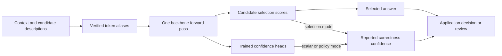

# myJEV: Build a Model That Chooses an Answer

Supply a request and a set of choices. myJEV returns the selected answer and its confidence.

I built myJEV to understand how a model can make decisions inside an application. The request contains context, an instruction and possible answers. The model scores those answers in one pass, then the application decides whether to accept the result or send it for review.

The inspiration is [Jev from TypeSafe AI](https://typesafe.ai/blog/introducing-system-one-models-and-jev). TypeSafe calls it a System One model: its interface accepts typed questions and returns decisions and probability information directly. What interested me was using language understanding to choose among request-supplied options without generating a written answer. Classification is familiar; making the task and choice descriptions part of each request gives us more to investigate. See the [TypeSafe API introduction](https://docs.typesafe.ai/introduction) for its interface and [our attribution notes](docs/attribution.md) for related implementations.

The project has two starting points: a small network trained from random weights and adaptations of pretrained Qwen language models. The experiments compare what they learn, how well confidence identifies mistakes, and what each model costs to serve. You can download the trained Qwen versions, inspect the saved outputs or rerun the code. TypeSafe’s underlying architecture remains undisclosed.

**Try it:** start with the downloadable [myJEV-4B](https://huggingface.co/bahree/myJEV-4B) and the commands below. Training is optional. A compatible NVIDIA GPU is required for the tested Qwen setup. If you prefer Docker, use the [container instructions](docs/quickstart.md#docker). Without a GPU, you can read the [recorded demos](results/demos-v1/report.md) or run the [CPU calibration lab](docs/decision-lessons.md#run-a-small-calibration-lab-on-cpu).

[Quick start](#quick-start) · [Learning route](#choose-a-learning-route) · [Documentation](docs/README.md) · [Measured results](#what-the-completed-comparison-found)

## Quick start

Tested environment: Linux, Python 3.12, and an NVIDIA A30 for GPU execution. The lock file includes CUDA-enabled PyTorch; install size is substantial even when only running CPU tests.

```bash
git clone --depth 1 https://github.com/bahree/myJEV.git
cd myJEV
python3.12 -m venv .venv
source .venv/bin/activate
.venv/bin/pip install -r requirements.lock
.venv/bin/pip install --no-deps -e .
```

To score with the public default, without retraining:

```bash
.venv/bin/myjev score --artifact bahree/myJEV-4B \
  --revision 38f7cca5a8530483309f576b0c3dd1756bc27c33 \
  --input examples/request.json
```

The code lives on GitHub; the trained files live on the **Hugging Face Hub**, a service for sharing models. The first call downloads the myJEV training updates and the original Qwen network they require. That original network is the **backbone**. Keep the `--revision` value to use the same model files as this example. The [installation guide](docs/quickstart.md#install-and-test) covers the host compiler needed by the GPU runtime and optional tests.

## An actual local request and response

For our first example, a customer says, “I was charged twice.” The application needs to route the issue to billing, technical support or another queue. The command reads `examples/request.json`: `context` is the customer message, `instructions` describes the task, and `candidates` lists the permitted answers with their meanings. The following request and saved response come from the released 4B model. [Validation evidence](results/release-validation-v1/myjev-4b-continued_sft-seed11/equivalence.json)

Request:

```json
{
  "context": "I was charged twice.",
  "instructions": "Select the appropriate support route.",
  "candidates": [
    {
      "id": "billing",
      "description": "Charges, invoices, and refunds"
    },
    {
      "id": "technical",
      "description": "Errors and configuration"
    },
    {
      "id": "other",
      "description": "Neither listed route applies"
    }
  ]
}
```

Response:

```json
{
  "selected_id": "billing",
  "selection_scores": {
    "billing": 0.9834240078926086,
    "technical": 0.005727097392082214,
    "other": 0.01084891613572836
  },
  "confidence": 0.9834240078926086,
  "confidence_mode": "selection",
  "artifact_revision": "3a7979eeff5cfb0bd2cee2fe2ea559c314ad9f5eef2de4ef4cb44759dbd73f02",
  "calibration_revision": "f0d2ddcaf6650e1f44415d49b1cf8b303d4d6fef5f73bb6198ee91600560e8d1"
}
```

The model selected `billing` and reported about 98.34% confidence. The selection scores rank the supplied choices. Confidence estimates whether the chosen answer is correct. Here those numbers match because this release uses the selected score after **temperature calibration**, an adjustment fitted on separate examples. Other releases use a separate learned confidence calculation. The [hands-on guide](docs/walkthrough.md#2-follow-one-decision) works through that distinction.

A high confidence value can still accompany a wrong answer. Run `python scripts/run_demos.py > demo-results.jsonl` in the activated environment to try seven requests: duplicate charges, an app crash, a hiking question, two refund dates, a misleading quote and a short post. The [demo walkthrough](results/demos-v1/report.md) explains each expected answer and retains the smaller model's confident refund mistake. It also lets you inspect the saved outputs without a GPU.

## Choose a learning route

Start by scoring a request, then follow it through the network. From there you can train a model, evaluate its decisions or run a service. The [hands-on walkthrough](docs/walkthrough.md) connects those steps; the table lets you jump to a particular task. The accompanying [blog](https://blog.desigeek.com) explains the experiments in more detail.

| I want to... | Read and run | What I will learn |
|---|---|---|
| Try the model | [Quick start](docs/quickstart.md) and [seven requests](results/demos-v1/report.md) | What goes into a request and how to read the result |
| Build a small model | [Architecture](docs/architecture.md) and [scratch walkthrough](docs/scratch.md) | How text becomes candidate scores, and where a tiny model fails |
| Build a decision head | [Candidate-attention head](docs/candidate-head.md) and [alias/Clef comparison](docs/unsloth.md) | How candidate spans and attention turn frozen Qwen features into scores |
| Adapt Qwen | [Training](docs/training.md) and [W&B tracking](docs/tracking.md) | What adapters learn, why the experiment has several methods, and how to inspect a run |
| Decide when to trust an answer | [Decision lessons](docs/decision-lessons.md), [CPU lab](results/calibration-lab-v1/report.md), and [findings](docs/qwen-findings.md) | How to check confidence and measure the cost of accepting mistakes |
| Call it from an application | [Inference](docs/inference.md) and [hosting](docs/hosting.md) | Python, CLI, HTTP, Docker, and the measured startup and serving costs |
| Check or reproduce the study | [Experiments](docs/experiments.md), [protocol](docs/protocol.md), and [data cards](docs/README.md#data-and-provenance) | Which data each experiment used and what supports its conclusions |

The optional [Unsloth comparison](docs/unsloth.md) studies another way to read a decision from the same 0.8B backbone: a joint schema head that scores request-supplied questions and choices. Across three seeds, Clef reached 83.50% mean BANKING77 accuracy versus 81.34% for aliases, with longer prompts and higher measured runtime. Those answer-only runs are separate from the supervised/RL results below. The [original 216K head](docs/candidate-head.md) reached 58.02% in its one-seed experiment and exposed confident routing errors in the demos.

The [Microsoft Decision-1 comparison](docs/decision-1.md) uses the same banking requests with local myJEV and a hosted model. It tests whether answer order, identifier spelling and formatting change decisions, and keeps service latency separate from local GPU timing. On its fixed 64 original test cases, Decision-1 answered 59 correctly, supervised myJEV 60 and RL 61. The small diagnostic does not choose a new default. OpenRouter access is optional; running myJEV uses no hosted account.

The [documentation index](docs/README.md) groups all guides by task, including model releases, troubleshooting, attribution and further experiments. The [engineering lessons](docs/learnings.md) explain decisions made along the way.

## Three sizes, one experimental interface

I used three sizes of the Qwen3.5 family to test what extra capacity adds. The names 0.8B, 4B and 9B refer to approximate billions of learned parameters. **LoRA** trains small weight updates, called adapters, while keeping the original weights fixed. The 9B configuration stores those original weights at lower precision to fit the GPU; this combination is called **QLoRA**. The [training guide](docs/training.md#choose-lora-and-qlora-for-the-available-memory) explains these choices and the BF16 and NF4 formats below.

| Backbone | Pilot precision | Adaptation | Observed training peak* |
|---|---|---|---:|
| Qwen3.5 0.8B | BF16 | LoRA | 1.7 GiB |
| Qwen3.5 4B | BF16 | LoRA | 8.5 GiB |
| Qwen3.5 9B | NF4 | QLoRA | 12.0 GiB |

\*PyTorch allocated-memory peaks in the initial supervised pilots on 24 GB A30 GPUs. These are not maximum-context serving requirements or minimum GPU recommendations. The 9B precision change also limits conclusions about capacity alone. Configurations pin the backbone revisions; see [hosting measurements](docs/hosting.md).

The pretrained backbone does most of the language processing. An adapter changes some of that computation; a **head** turns internal model features into a confidence estimate. The prompt gives each candidate a short token label, called an **alias**, which is mapped back to the application's original ID after scoring. This diagram shows where the answer and confidence come from:



The [architecture guide](docs/architecture.md) follows those steps. The scratch model uses a different scoring design and starts without pretrained language knowledge. It learned some controlled rules but chose the same class for every request in its banking test. The [scratch results](docs/scratch.md) retain that failure and the debugging steps.

## What the completed comparison found

BANKING77 contains customer messages labelled with 77 banking intents, such as the reason someone contacts support. The table reports the percentage of correct answers on all 3,080 official test examples, averaged across three random seeds. A seed controls the random initialization of new components and the training order.

**Supervised** training learns from labelled examples. **Continued supervision** gives that model more of the same training. **Reinforcement learning (RL)** instead uses a reward for correct answers and useful confidence. The exact method sums the reward over every possible answer/confidence action; the sampled method estimates that same objective from eight draws. The [training walkthrough](docs/training.md) explains why we compare all four.

Mean BANKING77 accuracy:

| Size | Supervised | Continued supervision | Exact RL | Sampled RL |
|---|---:|---:|---:|---:|
| 0.8B | 79.06% | **82.93%** | 81.36% | 80.53% |
| 4B | 86.48% | 89.23% | **90.27%** | 88.20% |
| 9B | 87.08% | 89.15% | **89.34%** | 88.54% |

Initial supervised training receives 4,000 updates. Each continuation receives 4,000 more from the same starting checkpoint for its seed. At 4B, exact RL beats continued supervision on two seeds and on the average, but loses on the third. An interval that resamples test examples excludes zero; variation between training seeds still includes gains and losses. Sampled RL trails exact RL in eight of nine size/seed pairs and in every size average.

Confidence needs a separate comparison. **Correctness Brier** measures squared error between reported confidence and whether the answer was right; lower is better. The released supervised configurations have lower mean Brier than the native RL confidence policy. Giving every method the same temperature-fitting opportunity changes that result: exact RL has a slightly lower mean at 4B and is lower on all three 9B seeds. This exploratory follow-up did not change the released default. The [findings guide](docs/qwen-findings.md) gives the per-seed results, uncertainty calculations and limitations.

I recommend **4B continued supervision with temperature scaling** as a starting point among the six releases. Its confidence and unsupported-option results were stronger than the released 4B RL configuration, and short three-candidate requests took a median 82.18 ms over HTTP on an A30. Exact RL had higher average 4B BANKING accuracy. Choose between them using the errors and costs that matter to your task; this recommendation combines observed results and remains exploratory. [Model comparison and serving measurements](docs/models.md#why-this-default-within-the-myjev-family)

For a fixed banking taxonomy, smaller classifiers are serious alternatives: TF-IDF reached 88.28%, and a separate single-seed 149.7M ModernBERT control reached 90.78% after three epochs. These differ in exposure and interface from myJEV. [Worked probability, cost and baseline lessons](docs/decision-lessons.md) explain the trade-off; [encoder evidence](results/encoder-control-v1/report.md) records the conditions.

The [short pilot](docs/experiments.md) tested whether the implementation worked before the longer study. The [policy-edit diagnostic](results/policy-edits-v1/report.md) separately checks explicit exceptions and changed rules using authored examples and one seed. Its results describe those myJEV examples, not PolicyLM performance.

The archive study asks a different question: can the model learn to classify posts from my blog? Its reference labels came from a separate model. Adaptation improved agreement with those labels, but that does not establish agreement with human readers. See the [archive data card](docs/datasets/blog-archive.md) and [adaptation results](docs/qwen-findings.md).

## Repository map

```text
myJEV/
├── src/myjev/       Shared model, objectives, training, evaluation, and serving
├── configs/         Pinned backbones and per-size training settings
├── scripts/         Data preparation, experiments, analysis, and verification
├── tests/           Numerical objective and inference-contract checks
├── examples/        Request fixtures and client examples
├── deploy/          Local Docker Compose and managed-hosting configuration
├── docs/            Reader guides, protocol, dataset cards, and roadmap
├── results/         Study reports, metrics, training logs, and figures
├── Dockerfile       Reference inference container
└── CHANGELOG.md     Versioned release history
```

The [results index](results/README.md) explains which evidence supports each finding. Large analysis inputs and the detailed short pilot are optional downloads; inference does not need them. A shallow clone avoids downloading historical Git objects.

Training creates local `data/`, `artifacts/`, and `.cache/` directories, which are excluded from Git. Adapters and heads are separately versioned on Hugging Face; their manifest-pinned backbone weights are downloaded separately.

## Models, containers and further work

The [model guide](docs/models.md) lists six releases on Hugging Face: three sizes, each with a supervised and an RL version. The myJEV loader combines their adapters and confidence heads with the required Qwen backbone. [Docker Hub](https://hub.docker.com/r/amitbahree/myjev) hosts the container that runs this same inference code. Downloadable files and a container image do not provide an always-on endpoint; the commands in this repository run the service on your machine.

The [scope and extensions](docs/roadmap.md) explains the limits of the experiments and questions worth exploring. The [release history](CHANGELOG.md) records changes to the implementation and published artifacts.

## Attribution and licensing

This project studies ideas from several decision-model implementations; it does not reproduce all of their architectures or published scores. See [attribution](docs/attribution.md), [OpenJev notes](docs/openjev.md), and the [dataset cards](docs/README.md#data-and-provenance).

The source code and accompanying repository documentation are licensed under [MIT](LICENSE), copyright Amit Bahree. Dataset, pretrained-backbone and other third-party licenses remain separate; this license does not replace them. Release model cards document the applicable weight terms.
