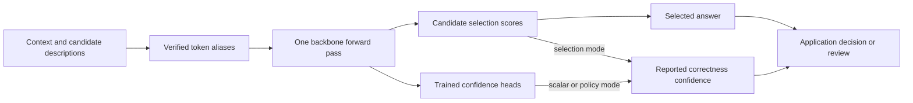

# myJEV: Decision Models, Confidence, and Reinforcement Learning

**Choose an answer. Estimate whether it is right. Know when to ask for review.**

myJEV explores a compact interface for language models: give the model some context and a set of candidate answers, then receive a structured decision in one backbone forward pass. There is no autoregressive answer generation. The project covers data, training objectives, calibration, evaluation, and a local GPU service across **0.8B, 4B, and 9B** models.

This is a research and learning project by [Amit Bahree](https://blog.desigeek.com). The repository will grow through reviewable milestone commits. The recorded milestones cover a scratch implementation, matched Qwen training, transfer tests, calibration controls, and local serving measurements.

> **Current milestone: training and local evaluation complete.** All 60 Qwen runs (168,000 updates), 36 main evaluations, 36 transfer/robustness jobs, the three-seed precision control and six local serving candidates are complete. The scratch model is built; its natural-language diagnostic failed. Read [the findings](docs/qwen-findings.md), [scratch lessons](docs/scratch.md) and [remaining work](docs/roadmap.md). The exploratory machine-reference archive adaptation and forgetting study is complete; independent human auditing remains. Public adapter/head releases are available on Hugging Face, starting with [myJEV-4B](https://huggingface.co/bahree/myJEV-4B); no hosted demo is running.

The second track now [builds a small decision model from scratch](docs/scratch.md), with recorded learning failures, a completed synthetic study and local serving checks. Its weak natural-language results remain separate from Qwen.

[Start here](docs/quickstart.md) · [Documentation](docs/README.md) · [Measured results](docs/qwen-findings.md) · [Roadmap](docs/roadmap.md)

## Choose a learning route

| Stage | Read and run | Concrete outcome |
|---|---|---|
| Build from scratch | [Scratch walkthrough](docs/scratch.md) | Trace byte tokens through an encoder, then inspect both learned rules and failures |
| Adapt a pretrained network | [Training](docs/training.md) | Follow LoRA, the update budget, supervised and exact/sampled branches |
| Evaluate decisions | [Experiments](docs/experiments.md) and [CPU lab](docs/walkthrough.md) | Separate accuracy, confidence, escalation and uncertainty |
| Use and host it | [Inference](docs/inference.md), [model releases](docs/models.md), [Docker](docs/hosting.md) | Run an actual request and serve the same output contract |

The [worked route](docs/walkthrough.md) connects equations, tensor shapes, commands and observed outputs. No training is needed to try the released model, and no GPU is needed for the arithmetic or calibration labs.

## Documentation by reader task

| I want to... | Guide |
|---|---|
| Work through code, math, outputs and evidence | [Hands-on learning route](docs/walkthrough.md) |
| Try seven original requests | [Runnable demos and retained failure](results/demos-v1/report.md) |
| Explore calibration on CPU | [Calibration lab](results/calibration-lab-v1/report.md) and [decision lessons](docs/decision-lessons.md) |
| Follow the complete documentation | [Documentation index](docs/README.md) |
| Build the small model and inspect its failures | [Scratch walkthrough](docs/scratch.md) |
| Understand Qwen results and their limits | [Qwen findings](docs/qwen-findings.md) |
| Reproduce training and understand the update budget | [Training](docs/training.md) |
| Track runs, epochs and GPU evidence | [W&B and local tracking](docs/tracking.md) |
| Check data provenance and evaluation rules | [Dataset cards](docs/README.md#data-and-provenance) and [protocol](docs/protocol.md) |
| Load, score and serve a local artifact | [Inference](docs/inference.md) |
| Run Docker or prepare managed hosting | [Hosting](docs/hosting.md) |
| Understand lessons, failures and remaining work | [Learnings](docs/learnings.md) and [roadmap](docs/roadmap.md) |

## What is a decision model?

Take a support request: **“I was charged twice.”** An application supplies choices such as billing, technical support, and other. myJEV selects one of those choices and returns two different quantities:

| Output | Meaning | How to use it |
|---|---|---|
| Selection scores | Normalized scores over the candidates supplied in this request | Select the highest-scoring candidate |
| Correctness confidence | An estimate that the selected answer is right | Evaluate a threshold for accepting or deferring a decision |

A high selection score is not automatically a reliable probability of correctness. Improving the confidence estimate does not automatically calibrate the entire selection distribution. That distinction is the reason for this project.



## What you can learn and run

- Build a candidate-selection interface using pinned Qwen3.5 backbones and LoRA adapters.
- Compare supervised training, continued supervision, exact expected-reward optimization, and eight-sample REINFORCE.
- Test calibration against temperature scaling and constant-confidence controls.
- Measure accepted-case error and coverage, alongside accuracy, Brier error, and resource use.
- Use the same inference implementation from Python, a CLI, HTTP, or Docker.
- Inspect saved predictions, reproduce charts, and follow what changes at each milestone.

See [architecture and objectives](docs/architecture.md) for the confidence head and reward, and [attribution](docs/attribution.md) for how this implementation relates to JevK5, JevForge, and OpenJev.

## Choose your starting point

| Goal | Start here | Requires |
|---|---|---|
| Understand the design | [Architecture](docs/architecture.md) | No installation |
| Inspect the actual findings | [Experiments and evidence](docs/experiments.md) | No GPU |
| Run the implementation tests | [Install and test](docs/quickstart.md#install-and-test) | Python; no model download |
| Train a first decision model | [Train the 0.8B pilot](docs/quickstart.md#train-the-08b-pilot) | Compatible NVIDIA GPU and backbone download |
| Score or serve your trained artifact | [Python, CLI, and HTTP](docs/quickstart.md#score-and-serve) | A local artifact from training |
| Run a GPU container | [Docker quick start](docs/quickstart.md#docker) | Docker with NVIDIA GPU access |
| Download a trained release | [Model release tracker](docs/models.md) | Public adapters/heads; custom loader and separate backbone |

The longer study uses one optimizer, AdamW, across several training approaches. Its completed 168,000 training steps were spread over 60 runs. See [the training-budget breakdown](docs/training.md#why-168000-training-steps) for the controls, costs, and progress definitions.

## Three sizes, one experimental interface

Fine-tuning tests whether task-specific adaptation and learned correctness confidence improve on an untouched pretrained model. We use LoRA/QLoRA to fit the existing hardware and retain compact adapters. Training is not required for single-pass scoring itself, and its benefit remains an empirical question. Read [why we fine-tune and why these adapter methods](docs/training.md#why-fine-tune-an-already-pretrained-model).

| Backbone | Pilot precision | Adaptation | Observed training peak* |
|---|---|---|---:|
| Qwen3.5 0.8B | BF16 | LoRA | 1.7 GiB |
| Qwen3.5 4B | BF16 | LoRA | 8.5 GiB |
| Qwen3.5 9B | NF4 | QLoRA | 12.0 GiB |

\*PyTorch allocated-memory peaks in the initial supervised pilots on 24 GB A30 GPUs. These are not maximum-context serving requirements or minimum GPU recommendations. The 9B precision change also limits conclusions about capacity alone. Configurations pin the backbone revisions; see [hosting measurements](docs/hosting.md).

## What the completed comparison found

Mean BANKING77 accuracy across three seeds on all 3,080 official test examples:

| Size | Supervised | Continued supervision | Exact RL | Sampled RL |
|---|---:|---:|---:|---:|
| 0.8B | 79.06% | **82.93%** | 81.36% | 80.53% |
| 4B | 86.48% | 89.23% | **90.27%** | 88.20% |
| 9B | 87.08% | 89.15% | **89.34%** | 88.54% |

Initial supervised training receives 4,000 updates. Each continuation receives 4,000 more from its matched supervised checkpoint. Exact RL leads continued supervision at 4B on two of three seeds and in the mean; the conditional test interval excludes zero, but seed deltas cross zero. Sampled RL trails exact RL in eight of nine pairs and in every size mean. The released supervised configurations have lower mean Brier than the native RL policy. Giving all methods identical selection-temperature fitting changes that comparison: exact RL has a slightly lower mean at 4B and is lower on all three 9B seeds. These follow-up controls are exploratory and do not change the released default. See [paired uncertainty, controls and limitations](docs/qwen-findings.md).

Within the six published myJEV variants, our exploratory starting recommendation is **4B continued supervision with temperature scaling**. It combines useful confidence, unsupported-option transfer and a measured 82.18 ms warm HTTP median on an A30 for short three-candidate requests. Exact RL remains available for its higher 4B BANKING accuracy. These are task-dependent trade-offs, not a universal ranking. [Candidate selection and resource measurements](docs/models.md#why-this-default-within-the-myjev-family)

For a fixed banking taxonomy, smaller classifiers are serious alternatives: TF-IDF reached 88.28%, and a separate single-seed 149.7M ModernBERT control reached 90.78% after three epochs. These differ in exposure and interface from myJEV. [Worked probability, cost and baseline lessons](docs/decision-lessons.md) explain the trade-off; [encoder evidence](results/encoder-control-v1/report.md) records the conditions.

The [short pilot](docs/experiments.md) remains recorded as an earlier feasibility milestone. A TF-IDF/logistic-regression control reaches **88.28%** on the official test set, with different training exposure. The [policy-edit diagnostic](results/policy-edits-v1/report.md) separately probes explicit exceptions and changed rules; it is synthetic, uses one seed, and is not a PolicyLM benchmark.

## Quick start

Tested environment: Linux, Python 3.12, and an NVIDIA A30 for GPU execution. The lock file includes CUDA-enabled PyTorch; install size is substantial even when only running CPU tests.

```bash
git clone https://github.com/bahree/myJEV.git
cd myJEV
python3 -m venv .venv
.venv/bin/pip install -r requirements.lock
.venv/bin/pip install --no-deps -e .
.venv/bin/python -m pytest -q
```

To score with the public default, without retraining:

```bash
.venv/bin/myjev score --artifact bahree/myJEV-4B \
  --revision 38f7cca5a8530483309f576b0c3dd1756bc27c33 \
  --input examples/request.json
```

The default [myJEV-4B](https://huggingface.co/bahree/myJEV-4B) is available on Hugging Face. These releases contain adapters, custom heads, calibration and manifests, not merged backbones. Use the myJEV loader, which separately loads the manifest-pinned Qwen backbone and tokenizer. Publishing these files does not create a hosted endpoint.

For a local model, follow the [data preparation and training commands](docs/quickstart.md). Once training creates `artifacts/pilot-0.8b/artifact`:

```bash
.venv/bin/myjev score --artifact artifacts/pilot-0.8b/artifact --input examples/request.json
.venv/bin/myjev serve --artifact artifacts/pilot-0.8b/artifact
```

The HTTP service provides `/score`, `/healthz`, and `/readyz`. It binds locally by default and rejects oversized requests. Python/CLI/HTTP/Docker equivalence has been checked for all six final local candidates. See [the complete quick start](docs/quickstart.md) for Python, curl, and Docker examples.

## An actual local request and response

This recorded response comes from `myjev-4b-continued_sft-seed11`, the temperature-calibrated local starting candidate. It is an observed fixture result, not a made-up output or a public endpoint. [Validation evidence](results/release-validation-v1/myjev-4b-continued_sft-seed11/equivalence.json)

Request:

```json
{
  "context": "I was charged twice.",
  "instructions": "Select the appropriate support route.",
  "candidates": [
    {
      "id": "billing",
      "description": "Charges, invoices, and refunds"
    },
    {
      "id": "technical",
      "description": "Errors and configuration"
    },
    {
      "id": "other",
      "description": "Neither listed route applies"
    }
  ]
}
```

Response:

```json
{
  "selected_id": "billing",
  "selection_scores": {
    "billing": 0.9834240078926086,
    "technical": 0.005727097392082214,
    "other": 0.01084891613572836
  },
  "confidence": 0.9834240078926086,
  "confidence_mode": "selection",
  "artifact_revision": "3a7979eeff5cfb0bd2cee2fe2ea559c314ad9f5eef2de4ef4cb44759dbd73f02",
  "calibration_revision": "f0d2ddcaf6650e1f44415d49b1cf8b303d4d6fef5f73bb6198ee91600560e8d1"
}
```

Here `confidence_mode: "selection"` means the artifact reports the temperature-scaled selected score as its correctness estimate. The RL artifacts instead use the expectation of their separate learned confidence policy. A confidence of 0.9834 for this fixture is not a guarantee of correctness or calibration on a new application.

## Repository map

```text
myJEV/
├── src/myjev/       Shared model, objectives, training, evaluation, and serving
├── configs/         Pinned backbones and per-size training settings
├── scripts/         Data preparation, experiments, analysis, and verification
├── tests/           Numerical objective and inference-contract checks
├── examples/        Request fixtures and client examples
├── deploy/          Local Docker Compose and managed-hosting configuration
├── docs/            Reader guides, protocol, dataset cards, and roadmap
├── results/         Recorded metrics, predictions, manifests, and figures
├── Dockerfile       Reference inference container
└── CHANGELOG.md     Reader-facing milestone history
```

Training creates local `data/`, `artifacts/`, and `.cache/` directories, which are excluded from Git. Adapters and heads are separately versioned on Hugging Face; their manifest-pinned backbone weights are downloaded separately.

## Blog series and upcoming releases

The articles will be published on [Desi Geek](https://blog.desigeek.com), with links back to this repository. Article links will be added after publication; their Markdown sources are not part of this repository.

| Article | Publication status |
|---|---|
| Building myJEV (Part 1): Decision Models and a Build from Scratch | Draft; publication link to follow |
| Building myJEV (Part 2): Fine-Tuning Qwen and Learning from Training | Draft; publication link to follow |
| Building myJEV (Part 3): Evaluation, Confidence, and Transfer | Draft; publication link to follow |
| Building myJEV (Part 4): Inference, Docker, and Hosting | Draft; publication link to follow |

The [roadmap](docs/roadmap.md) separates completed engineering checks from upcoming experiments. The [model tracker](docs/models.md) links public adapter/head releases, immutable revisions, and reproducible load commands. The tested GPU image is published on [Docker Hub](https://hub.docker.com/r/amitbahree/myjev); [pull and run it](docs/inference.md#gpu-docker) using the recorded immutable digest. There is no paid managed endpoint running.

## Attribution and licensing

This project studies ideas from several decision-model implementations; it does not reproduce all of their architectures or published scores. See [attribution](docs/attribution.md), [OpenJev notes](docs/openjev.md), and the [dataset cards](docs/README.md#data-and-provenance).

The source code and accompanying repository documentation are licensed under [MIT](LICENSE), copyright Amit Bahree. Dataset, pretrained-backbone and other third-party licenses remain separate; this license does not replace them. Release model cards will document the applicable weight terms.
