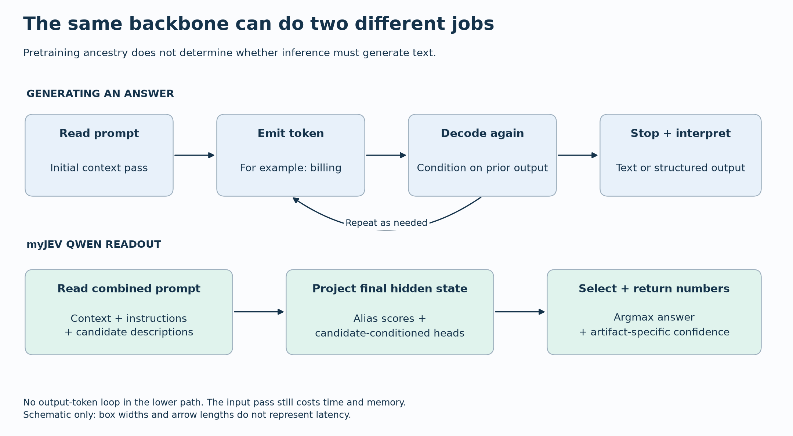
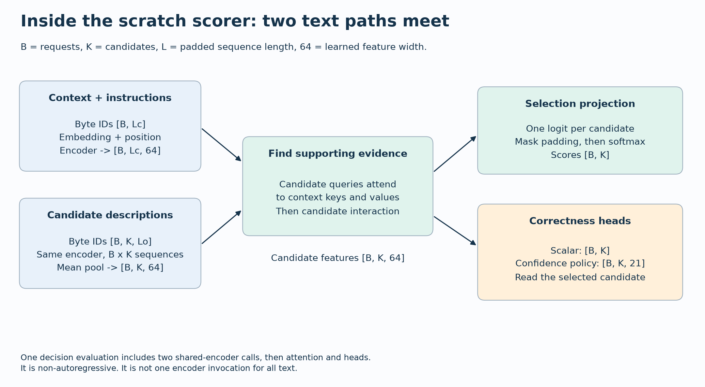

# Architecture and objectives

myJEV receives context, task instructions, and 2–160 candidate IDs and descriptions. Candidate IDs belong to the calling application; they are not a fixed global label vocabulary.

## One forward pass

1. Map candidates to verified single-token aliases and render the pinned prompt template.
2. Tokenize the complete input. Reject inputs beyond the artifact's configured limit rather than silently truncating.
3. Run the backbone once and use its final hidden state for candidate scores and confidence.
4. Select the highest-scoring candidate and return its original ID, normalized scores, and correctness confidence.

Training randomizes candidate order. That does not guarantee order invariance; order changes require evaluation.

The reference implementation is in [model.py](../src/myjev/model.py), [prompt.py](../src/myjev/prompt.py), and [inference.py](../src/myjev/inference.py). Custom heads and adapters require this loader; a generic text-generation server does not automatically reproduce the outputs.

## What fine-tuning changes

The backbone weights stay frozen. Training updates attention LoRA adapters and the custom confidence heads. The 0.8B/4B backbones use BF16; 9B uses NF4 QLoRA for memory fit. The pretrained model already supports token scoring. Adaptation tests whether task decisions and learned correctness estimates improve over the untouched model and simpler calibration controls. See [why we fine-tune](training.md#why-fine-tune-an-already-pretrained-model) for the rationale, resource trade-offs and limits.

## Confidence has its own meaning

The supervised implementation includes a scalar correctness head. The RL experiment uses a candidate-conditioned policy over 21 confidence values: 0.00, 0.05, …, 1.00. At inference, an RL artifact reports the expected confidence for its deterministically selected answer. The grid is an experimental parameterization, not a necessary property of decision models.

The loader declares the confidence source explicitly:

| `confidence_mode` | Correctness estimate | Where it is used |
|---|---|---|
| `scalar` | Sigmoid of the learned scalar head for the selected answer | Native supervised study outputs |
| `policy` | Expected value of the selected answer's 21-value confidence policy | Released RL variants |
| `selection` | Selected candidate probability, with the artifact's fitted temperature | Released standard variants |
| `constant` | One fixed confidence value for every answer | Base-rate and constant-confidence controls |

An RL artifact still stores its earlier scalar head, but RL does not optimize that head; post-RL scalar diagnostics are not a trained RL confidence estimate. The matched follow-up calibrates the trained policy expectation instead. See [confidence controls](qwen-findings.md#give-every-method-the-same-calibration-opportunity).

Selection scores sum to one over the supplied options. Correctness confidence estimates whether the selected answer is right. Missing the correct option can still produce a high selection score, so unsupported requests need explicit evaluation.

See [four probability meanings and a numerical reward example](decision-lessons.md#four-probabilities-that-are-easy-to-confuse). The spread of the 21-bin policy is not a validated measure of epistemic uncertainty.

## Same objective, exact and sampled gradients

For correctness `c` in `{0, 1}` and confidence `q`, the confidence-aware reward is:

```text
R(c, q) = c - (q - c)^2
```

Exact optimization sums over the finite joint answer/confidence action space. Sampled REINFORCE draws eight actions per example and uses a leave-one-out baseline. Both use AdamW to update the same trainable components, with the same policy architecture and KL regularization against a frozen supervised reference. Correctness-only reward, continued supervised training, Brier auxiliary supervision, temperature scaling, and constant-confidence controls test alternative explanations.

The scoring component alone does not guarantee calibration of the combined, regularized objective. [Objective tests](../tests/test_objectives.py) check arithmetic, finite-difference gradients, and sampled-gradient agreement. [The protocol](protocol.md) explains matched initialization and exposure; [the results](experiments.md) distinguish sampled training behavior from deployed argmax decisions.

## PolicyLM and the pretrained-encoder middle ground

PolicyLM is relevant related work, not a measured myJEV baseline. It specializes in moderation, reads policy and content together, and emits category scores without generating explanations. Its pretrained BidirLM encoder derives from Qwen3. This illustrates why backbone ancestry and deployment behavior are separate choices: pretrained language representations can support a non-generative decision interface. See the [announcement](https://www.musubilabs.ai/blog/introducing-policylm-1-7b).

The untouched GLiClass baseline already measures one pretrained encoder: its pinned small checkpoint reached 10.81% BANKING accuracy. That narrow result is not an architecture verdict. Our two implemented build tracks explore random initialization and Qwen adaptation. A pretrained bidirectional encoder is a useful next experiment between them. It could supply language representations missing from our tiny scratch model while using a specialized readout. That is a hypothesis, not evidence that it will outperform either track.

PolicyLM supports up to 16 categories per policy and a shared 2,048-token context, with windowing for long messages. Its published 35 ms L4 median concerns short messages; it is not comparable to our A30 HTTP measurements. Category scores are not automatically calibrated selected-answer correctness confidence. Its card discloses that all evaluation sets except OR-Bench were also used in development. See the [model card](https://huggingface.co/musubilabs/policylm-1.7b).

We added a prospective diagnostic of explicit exceptions and minimal policy edits, with expected decisions fixed before inference. It is separate from the completed training comparison. A moderation classifier does not supply verified archive labels or evidence quotations. No PolicyLM benchmark has been run here.

### What changes when the backbone becomes an encoder?

Our adapted Qwen network retains its causal sequence computation. We read decision features from the final position and stop after that forward pass. Eliminating generated answer tokens saves decoding work, but it does not eliminate the cost of reading the prompt or storing the backbone. A small LoRA adapter only describes the learned update; inference still loads the base model.

A bidirectional encoder lets token representations use context on both sides. That can suit classification because the entire policy and document are available before a decision is made. Pretraining supplies language features; the specialized head supplies task outputs. Our scratch encoder has the same broad opportunity to use both directions, but it starts with random weights and a tiny training corpus. Architecture alone does not supply the knowledge and representations learned during large-scale pretraining.

The output contract matters just as much. A moderation system can legitimately assign high scores to several categories at once. Our interface instead chooses one candidate and estimates whether that selected answer is correct. Neither normalized candidate scores nor independent category scores automatically provide that latter probability. This is why a PolicyLM-inspired encoder experiment would need a declared task mapping, matched inputs, and its own calibration evaluation before becoming a comparable baseline.

PolicyLM therefore informs our next hypothesis: a pretrained encoder may improve the language foundation missing from the scratch track while keeping a specialized decision interface. It does not establish that this architecture is faster or more accurate on our hardware and tasks. It also does not resolve subjective archive labels or provide evidence citations.

### Separate the backbone, decision head and training method

The backbone produces representations of the input. The decision head turns those representations into the outputs the application needs, such as candidate scores or a correctness estimate. Fine-tuning determines which parameters change while learning that task. These are separate design choices: we can train a new head while freezing the backbone, train the head alongside LoRA adapters, or update the backbone more extensively. In myJEV's Qwen track, the vocabulary readout supplies selection scores while adapters and custom confidence heads are trained.

The same separation helps explain multimodal designs. Text, image or audio encoders can supply representations to a decision layer, but each input type needs an appropriate processing path and training signal. Adding a decision head alone does not teach a text-only model to understand an image.

Each output probability also needs a clearly defined event. “Does this document contain a refund date?” differs from “Is the selected support route correct?” A document can omit the date while still providing enough information to route the request. Training a head for one event does not make its output a calibrated estimate of the other. This is why our response contract explicitly names selected-answer correctness.

Performance belongs to the complete serving system. When comparing timings, record the input length, candidate count, hardware, precision and cache state. Establish whether the system processes the full input or uses retrieval, chunking or another shortcut, and evaluate the resulting decisions under that same configuration. The weights, processing strategy and runtime together determine the work being timed. The [inference guide](inference.md) applies these principles to our own measurements.

### Can an edited policy change the decision?

The PolicyLM discussion led to a bounded test rather than another training matrix. Before inference, we froze 24 original pairs from six templates: refund windows, numeric boundaries, explicit exceptions, exception removal, irrelevant exceptions, and quoted instructions. Sixteen pairs require an answer change; eight require the answer to stay the same. Each pair keeps the input and candidates fixed and changes only the policy. The six existing seed-11 release candidates then scored all 48 requests, without fitting new calibration parameters.

| Size | Method | Answer accuracy | Both answers in pair correct | Confidence Brier |
|---|---|---:|---:|---:|
| 0.8b | Continued SFT + temperature | 52.1% | 33.3% | 0.3731 |
| 0.8b | Exact RL | 56.2% | 37.5% | 0.2089 |
| 4b | Continued SFT + temperature | 100.0% | 100.0% | 0.0062 |
| 4b | Exact RL | 81.2% | 79.2% | 0.1488 |
| 9b | Continued SFT + temperature | 93.8% | 87.5% | 0.0499 |
| 9b | Exact RL | 100.0% | 100.0% | 0.1866 |

The small model often ignored the meaningful edit. Its supervised candidate changed on only 5 of the 16 pairs that required a change. A perfect invariance score did not rescue it: it sometimes kept the same wrong answer. This is why we report both-answer correctness alongside change rates.

Selection and confidence also told different stories. The 9B exact-RL candidate answered every fixture correctly, yet its confidence Brier was 0.1866, versus 0.0062 for the equally accurate 4B supervised candidate. The former reported expected confidence from its learned grid policy; the latter reported temperature-scaled selected probability. These are the deployed outputs, not a freshly fitted comparison. This result illustrates why correct decisions and useful confidence need separate checks; it does not establish calibration over a population.

The fixtures are deliberately simple and correlated. One seed and six templates cannot establish an RL benefit, a scaling law, or reliable real-world policy compliance. This diagnostic evaluated only the six myJEV candidates. The learning is methodological: freeze the expected response to a rule edit, include edits that should change nothing, and inspect correctness and confidence separately.

The [frozen diagnostic report](https://github.com/bahree/myJEV/blob/main/results/policy-edits-v1/report.md) includes all six candidates, reproduction commands, predictions, and limitations.

## Trace the computation





Regenerate these original diagrams with `python scripts/draw_decision_diagrams.py`; [source provenance](../results/teaching-diagrams-v1/manifest.json) records the rendered assets.

## Try a numeric suffix readout

A [seven-case untouched-backbone probe](../results/numeric-readout-v1/report.md) compares existing single-token aliases with complete numeric suffix probabilities on the same pinned BF16 4B backbone. Both answered all seven original demos correctly. The prompt and readout both change, the examples were previously viewed, and there is no confidence calibration, so this is a method-inspired implementation demonstration rather than a paper reproduction or broader accuracy result.

`scripts/numeric_readout_probe.py` teacher-forces full candidate continuations, including their closing bracket, and sums suffix log probabilities. It repeats the prompt instead of implementing cached prefill branches; its timings must not be read as a speed comparison. [Numeric readout tests](../tests/test_numeric_readout.py) check suffix arithmetic and token-boundary failures. See the [source review](system-one-research.md) for the external method's distinct training and inference semantics.
