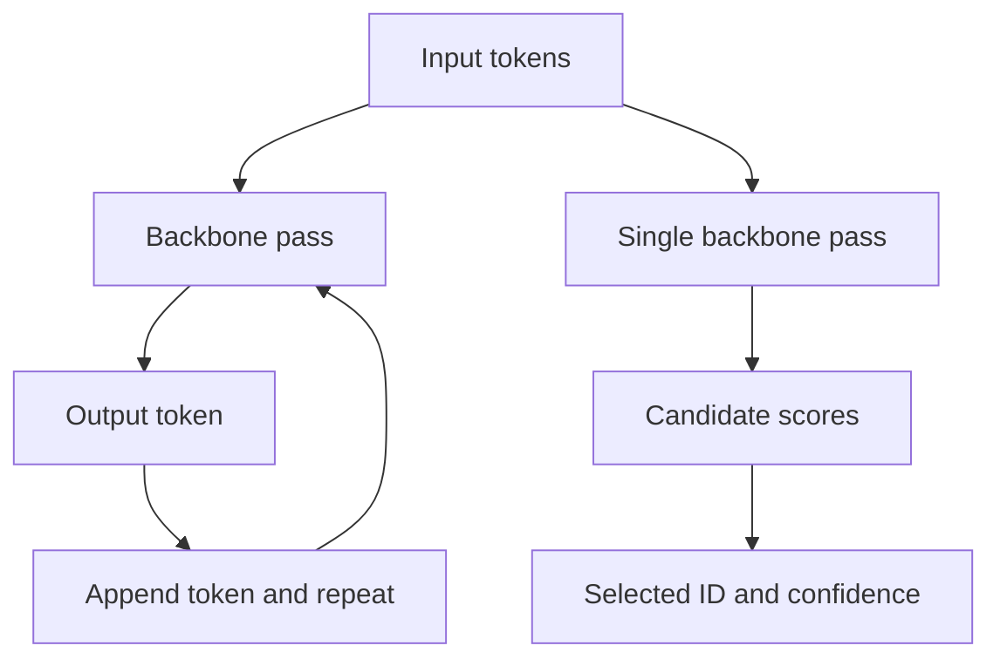
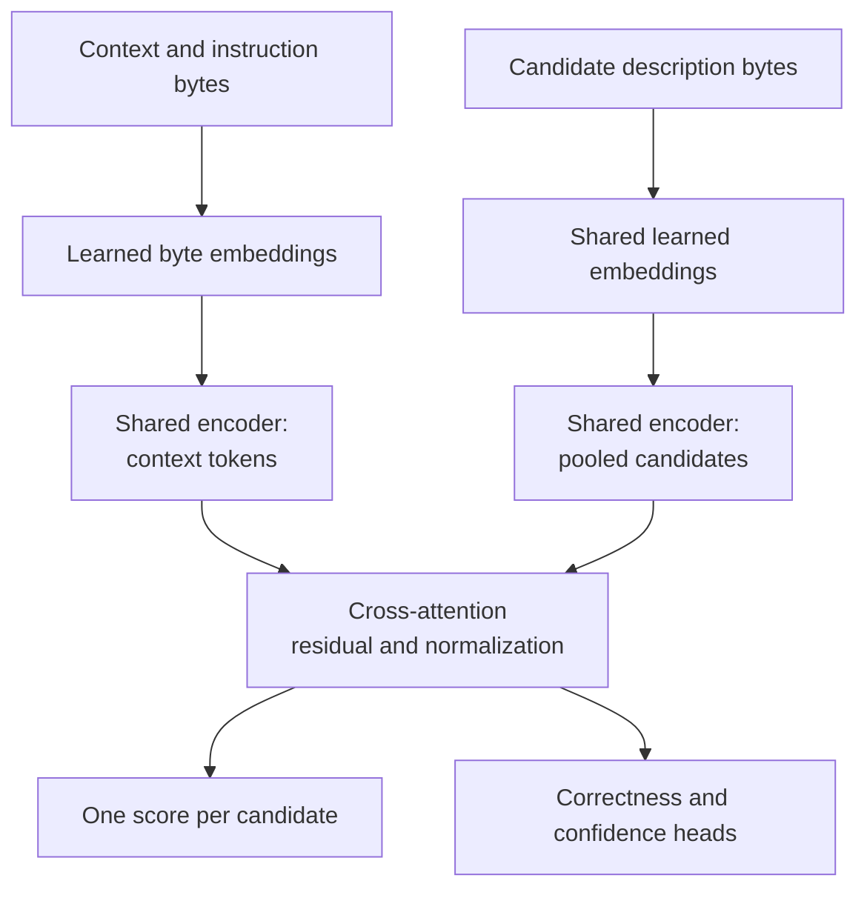

# Architecture and objectives

The [first request](../examples/request.json) asks whether a duplicate charge belongs to billing, technical support or another route. This guide follows how the model turns that input into an answer. Start with the [walkthrough](walkthrough.md#2-follow-one-decision) if you want to inspect the response fields first.

The released Qwen implementation receives context, instructions, and 2-160 candidate IDs and descriptions. The caller supplies those choices with each request. A **backbone** is the pretrained network that reads the text; an **adapter** stores learned changes to its computation; a **head** maps internal features to an output such as confidence. The [scratch model](scratch.md) uses the same kind of request but learns its text features from random weights.

## One forward pass

1. Give each candidate a short **alias**, a label verified to occupy one tokenizer unit, or token. Put those aliases, the candidate descriptions and the context into the saved prompt template.
2. Convert the prompt into token IDs. Reject inputs beyond the model package's configured limit rather than silently cutting away text.
3. Run the Qwen backbone once. Its internal features at the final input position provide the alias scores and the confidence-head input. No answer tokens are generated.
4. Normalize the candidate scores to sum to one, select the largest, and map its alias back to the caller's ID, such as `billing`. Return the scores and the configured correctness estimate too.

Training randomizes candidate order. The [full-test permutation check](../results/review-order-v1/report.md) still changes selected answers on about 8-10% of 0.8B requests and 3.6-5.0% at larger sizes per tested permutation. Each request has its own seeded shuffle. Order also reassigns aliases, so this is combined sensitivity, not an isolated position effect.

The reference implementation is in [model.py](../src/myjev/model.py), [prompt.py](../src/myjev/prompt.py), and [inference.py](../src/myjev/inference.py). Custom heads and adapters require this loader; a generic text-generation server does not automatically reproduce the outputs.

## Trace the computation

The first diagram contrasts repeated answer-token generation with the Qwen scoring path above. The network still reads the input; the saving is that we stop after computing candidate scores instead of generating an answer.



The scratch model follows a different path. It encodes the context and candidate descriptions separately using shared weights, then lets each candidate attend to the context. Those are two calls to the same encoder inside one decision computation. The [scratch guide](scratch.md) explains the arrays and attention operations.




Regenerate these original diagrams with `python scripts/draw_decision_diagrams.py`; [source provenance](../results/teaching-diagrams-v1/manifest.json) records the rendered assets.

## What fine-tuning changes

The backbone weights stay frozen. Training updates attention LoRA adapters and the custom confidence heads. The 0.8B/4B backbones use BF16; 9B uses NF4 QLoRA for memory fit. The pretrained model already supports token scoring. Adaptation tests whether task decisions and learned correctness estimates improve over the untouched model and simpler calibration controls. See [why we fine-tune](training.md#why-fine-tune-an-already-pretrained-model) for the rationale, resource trade-offs and limits.

## Confidence has its own meaning

Selection scores choose the answer; confidence estimates whether that answer is right. The supervised stage trains both a **scalar** head, which produces one correctness estimate per candidate, and a confidence policy over 21 values: 0.00, 0.05, …, 1.00. The RL continuation optimizes the latter. Its released confidence is the probability-weighted average of those values for the selected answer. The ordinary supervised releases instead use the selected probability after temperature calibration. These are different sources for the same reported quantity, as the table shows.

The loader declares the confidence source explicitly:

| `confidence_mode` | Correctness estimate | Where it is used |
|---|---|---|
| `scalar` | Sigmoid of the learned scalar head for the selected answer | Native supervised study outputs |
| `policy` | Expected value of the selected answer's 21-value confidence policy | Released RL variants |
| `selection` | Selected candidate probability, with the artifact's fitted temperature | Released standard variants |
| `constant` | One fixed confidence value for every answer | Base-rate and constant-confidence controls |

An RL artifact still stores its earlier scalar head, but RL does not optimize that head; post-RL scalar diagnostics are not a trained RL confidence estimate. The matched follow-up calibrates the trained policy expectation instead. See [confidence controls](qwen-findings.md#give-every-method-the-same-calibration-opportunity).

Selection scores sum to one over the supplied options. Correctness confidence estimates whether the selected answer is right. Missing the correct option can still produce a high selection score, so unsupported requests need explicit evaluation.

See [four probability meanings and a numerical reward example](decision-lessons.md#four-probabilities-that-are-easy-to-confuse). The spread of the 21-bin policy is not a validated measure of epistemic uncertainty.

## Same objective, exact and sampled gradients

For correctness `c` in `{0, 1}` and confidence `q`, the confidence-aware reward is:

```text
R(c, q) = c - (q - c)^2
```

Exact optimization sums over the finite joint answer/confidence action space. Sampled REINFORCE draws eight actions per example and uses a leave-one-out baseline. Both use AdamW to update the same trainable components, with the same policy architecture and KL regularization against a frozen supervised reference. Correctness-only reward, continued supervised training, Brier auxiliary supervision, temperature scaling, and constant-confidence controls test alternative explanations.

The scoring component alone does not guarantee calibration of the combined, regularized objective. [Objective tests](../tests/test_objectives.py) check arithmetic, finite-difference gradients, and sampled-gradient agreement. [The protocol](protocol.md) explains matched initialization and exposure; [the results](experiments.md) distinguish sampled training behavior from deployed argmax decisions.

## PolicyLM and the pretrained-encoder middle ground

PolicyLM is relevant related work, not a measured myJEV baseline. It specializes in moderation, reads policy and content together, and emits category scores without generating explanations. Its pretrained BidirLM encoder derives from Qwen3. This illustrates why backbone ancestry and deployment behavior are separate choices: pretrained language representations can support a non-generative decision interface. See the [announcement](https://www.musubilabs.ai/blog/introducing-policylm-1-7b).

We tested two pretrained encoders locally. The untouched GLiClass small checkpoint reached 10.81% BANKING accuracy; the adapted, fixed-label ModernBERT control performed much better, as the [findings](qwen-findings.md) show. Their task interfaces and training differ, so neither result predicts how a new policy-conditioned encoder would perform.

PolicyLM supports up to 16 categories per policy and a shared 2,048-token context, with windowing for long messages. Its published 35 ms L4 median concerns short messages; it is not comparable to our A30 HTTP measurements. Category scores are not automatically calibrated selected-answer correctness confidence. Its card discloses that all evaluation sets except OR-Bench were also used in development. See the [model card](https://huggingface.co/musubilabs/policylm-1.7b).

The policy-edit diagnostic below tests explicit exceptions and small rule changes, with expected decisions fixed before inference. It is separate from the training comparison. A moderation classifier does not supply verified archive labels or evidence quotations. No PolicyLM benchmark has been run here.

### What changes when the backbone becomes an encoder?

Our adapted Qwen network retains its causal sequence computation. We read decision features from the final position and stop after that forward pass. Eliminating generated answer tokens saves decoding work, but it does not eliminate the cost of reading the prompt or storing the backbone. A small LoRA adapter only describes the learned update; inference still loads the base model.

A bidirectional encoder lets token representations use context on both sides. That can suit classification because the entire policy and document are available before a decision is made. Pretraining supplies language features; the specialized head supplies task outputs. Our scratch encoder has the same broad opportunity to use both directions, but it starts with random weights and a tiny training corpus. Architecture alone does not supply the knowledge and representations learned during large-scale pretraining.

Moderation can assign high scores to several categories at once. myJEV chooses one candidate and reports confidence in that selection. A comparison therefore needs a common task and an explicit meaning for each probability before fitting calibration or comparing error rates.

A policy-conditioned pretrained encoder is a possible extension: it could supply the language knowledge missing from the scratch model while accepting new candidate descriptions. We would still need to train and evaluate that interface on our tasks. Archive label reliability would remain a separate problem.

### Separate the backbone, decision head and training method

The backbone produces representations of the input. The decision head turns those representations into the outputs the application needs, such as candidate scores or a correctness estimate. Fine-tuning determines which parameters change while learning that task. These are separate design choices: we can train a new head while freezing the backbone, train the head alongside LoRA adapters, or update the backbone more extensively. In myJEV's Qwen track, the vocabulary readout supplies selection scores while adapters and custom confidence heads are trained.

The same separation helps explain multimodal designs. Text, image or audio encoders can supply representations to a decision layer, but each input type needs an appropriate processing path and training signal. Adding a decision head alone does not teach a text-only model to understand an image.

Consider two questions: “Does this document contain a refund date?” and “Is the selected support route correct?” A document might omit the date and still give us enough information to route the request. A head trained to answer the first question would estimate the wrong quantity for the second. myJEV’s confidence is intended to describe selected-answer correctness, and that is what we evaluate.

Performance belongs to the complete serving system. When comparing timings, record the input length, candidate count, hardware, precision and cache state. Establish whether the system processes the full input or uses retrieval, chunking or another shortcut, and evaluate the resulting decisions under that same configuration. The weights, processing strategy and runtime together determine the work being timed. The [inference guide](inference.md) applies these principles to our own measurements.

### Can an edited policy change the decision?

The PolicyLM discussion prompted a test of rule edits on the existing checkpoints. Before inference, we froze 24 original pairs from six templates: refund windows, numeric boundaries, explicit exceptions, exception removal, irrelevant exceptions, and quoted instructions. Sixteen pairs require an answer change; eight require the answer to stay the same. Each pair keeps the input and candidates fixed and changes only the policy. The six existing seed-11 release candidates then scored all 48 requests, without fitting new calibration parameters.

| Size | Method | Answer accuracy | Both answers in pair correct | Confidence Brier |
|---|---|---:|---:|---:|
| 0.8b | Continued SFT + temperature | 52.1% | 33.3% | 0.3731 |
| 0.8b | Exact RL | 56.2% | 37.5% | 0.2089 |
| 4b | Continued SFT + temperature | 100.0% | 100.0% | 0.0062 |
| 4b | Exact RL | 81.2% | 79.2% | 0.1488 |
| 9b | Continued SFT + temperature | 93.8% | 87.5% | 0.0499 |
| 9b | Exact RL | 100.0% | 100.0% | 0.1866 |

The small supervised model changed its answer on only 5 of the 16 pairs that required a change. It also kept some wrong answers unchanged. Checking both answers in each pair catches that failure; a score for consistency alone would miss it.

Selection and confidence also told different stories. The 9B exact-RL candidate answered every fixture correctly, yet its confidence Brier was 0.1866, versus 0.0062 for the equally accurate 4B supervised candidate. The former reported expected confidence from its learned grid policy; the latter reported temperature-scaled selected probability. These are the deployed outputs, not a freshly fitted comparison. This result illustrates why correct decisions and useful confidence need separate checks; it does not establish calibration over a population.

The diagnostic covers one seed and six simple templates. It checks whether meaningful rule edits change the answer and irrelevant edits leave it alone. These correlated examples are too narrow to settle the RL comparison, measure scaling or establish reliable real-world policy compliance.

The [frozen diagnostic report](https://github.com/bahree/myJEV/blob/main/results/policy-edits-v1/report.md) includes all six candidates, reproduction commands, predictions, and limitations.

## Try a numeric suffix readout

A [seven-case untouched-backbone probe](../results/numeric-readout-v1/report.md) compares existing single-token aliases with complete numeric suffix probabilities on the same pinned BF16 4B backbone. Both answered all seven original demos correctly. The prompt and readout both change, the examples were previously viewed, and there is no confidence calibration, so this is a method-inspired implementation demonstration rather than a paper reproduction or broader accuracy result.

`scripts/numeric_readout_probe.py` teacher-forces full candidate continuations, including their closing bracket, and sums suffix log probabilities. It repeats the prompt instead of implementing cached prefill branches; its timings must not be read as a speed comparison. [Numeric readout tests](../tests/test_numeric_readout.py) check suffix arithmetic and token-boundary failures. See the [source review](system-one-research.md) for the external method's distinct training and inference semantics.

Candidate-order change rates are per permutation, each compared with the original order. They are not the fraction of requests that could change under any possible ordering.
