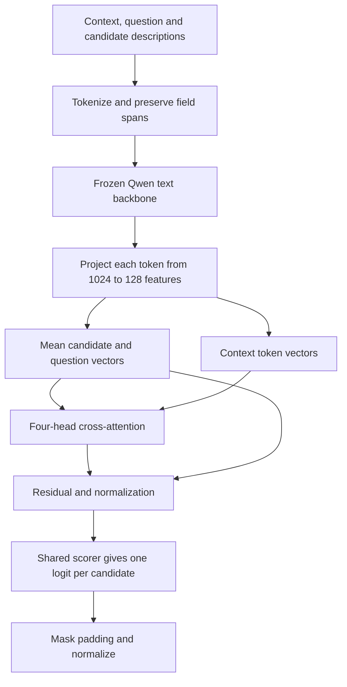

# Build a candidate-attention head on frozen Qwen

The released myJEV models choose answers by reading token scores from Qwen’s existing vocabulary projection. This experiment replaces that selection calculation with a small network trained to compare the supplied choices. Qwen reads the text; a new head uses its token representations to score each candidate.

The head has 216,193 trainable parameters on the pinned Qwen3.5-0.8B text backbone. Every backbone parameter stays frozen. There are no LoRA adapters or learned correctness heads in this experiment. Its purpose is to make the head’s computation visible and test whether this configuration can learn BANKING77. The [three-seed alias/Clef comparison](unsloth.md) has its own protocol and remains a separate study.

Use the [reference installation](quickstart.md#install-and-test), including `requirements.lock`. This implementation uses PyTorch’s attention layer and our reference Transformers loader. It does not require the optional Unsloth environment. The [source](../src/myjev/candidate_head.py) and [configuration](../configs/candidate-head-v1.json) specify the architecture and experiment.

## An attention head is one part of the decision head

An **attention head** learns query, key and value projections and uses them to combine information from selected token positions. A **decision head** turns the backbone’s representations into application outputs. Our decision head contains a projection, an attention layer with four attention heads, normalization and a scorer.

Unsloth’s Clef conversion motivated the head comparison. Clef’s 27,324,932-parameter joint schema head has routing and decoding layers and supports several questions sharing a backbone pass. Our original implementation uses one cross-attention layer and answers one candidate-selection question per request. It reuses the idea of candidate-to-context attention from this project’s [scratch model](scratch.md), while replacing the randomly initialized byte encoder with frozen Qwen representations.



## Keep field boundaries through tokenization

The request still contains `context`, `instructions` and a candidate list. The renderer writes a JSON-escaped string for each field and records its character span. Caller IDs remain outside the prompt. The options receive positional labels such as `OPTION 0`, with their descriptions following them.

The fast tokenizer returns character offsets for each token. A token overlapping a field’s span belongs to that field’s mask. The model encodes the whole request before checking the 4,096-token cap; oversized requests are rejected without truncation. The shared request schema also enforces candidate count and aggregate-text limits. Those limits constrain accepted input shape; the experiment’s quality measurements cover its recorded inputs.

For a batch of $B$ requests with $L$ padded token positions and up to $K$ candidates, Qwen returns $H\in\mathbb{R}^{B\times L\times1024}$. A learned projection produces

$$X=\operatorname{Linear}_{1024\to128}(\operatorname{LayerNorm}(H)).$$

`context_mask` and `question_mask` have shape `B x L`; `candidate_mask` has shape `B x K x L`. They identify the token positions pooled or attended to. `valid`, shaped `B x K`, marks candidates present in each request. Pooling divides the sum of a field’s vectors by its token count, so a longer description does not receive a larger vector merely because it contains more tokens.

## Let each candidate retrieve context information

Let $c_i$ be the mean projected representation for candidate $i$, and $u$ the mean question representation. The candidate query is $a_i=c_i+u$. Question wording can therefore affect all candidate scores.

Each attention head uses learned matrices to form queries $Q$, keys $K_c$ and values $V_c$. The keys and values come from context positions. For one attention head,

$$E=\operatorname{softmax}\left(\frac{QK_c^\top}{\sqrt{32}}+M\right)V_c.$$

The 128 projected features are divided among four attention heads, giving 32 query/key features per head. $M$ is zero on context positions and negative infinity elsewhere. Softmax runs across token positions. PyTorch combines the four outputs through a learned projection.

Suppose a candidate assigns weights 0.7, 0.2 and 0.1 to three context vectors. Its evidence is $0.7v_1+0.2v_2+0.1v_3$. These invented values illustrate the operation; attention weights alone would not prove why the trained model chose an answer.

The implementation’s central steps are:

```python
queries = candidates + question[:, None, :]
evidence, _ = self.cross(
    queries, features, features,
    key_padding_mask=~context_mask, need_weights=False,
)
combined = self.norm(queries + evidence)
logits = self.score(combined).squeeze(-1)
logits = logits.masked_fill(~valid, -torch.inf)
```

`self.score` is `Linear(128,128)`, GELU and `Linear(128,1)`. The same scorer operates on every candidate, so adding another allowed description does not require a new output neuron. Negative infinity excludes padded slots from softmax. The selected candidate maps back to the caller’s original ID.

A shared scorer is equivariant to reordering candidate vectors while holding all backbone features fixed. Reordering the input text can still change those features: Qwen is causal, and later candidate descriptions can depend on earlier ones. The unit test checks the first property and makes no claim about the second.

## Train only the head

The frozen protocol uses answer cross-entropy, $L=-\log p_y$, where $y$ is the labelled candidate. Three equal logits yield probability $1/3$ for the correct answer and loss $\log3\approx1.0986$. Training changes the head’s parameters to increase the probability of the labelled choice.

The backbone runs under `torch.no_grad()` with BF16 weights. The head, logits and loss use FP32. AdamW updates only the head at learning rate 0.001, with weight decay 0.01 and gradient clipping at 1. A microbatch contains four requests; two microbatches accumulate into one update. The 1,000-update main run sees 8,000 examples, about one pass through the 7,999-row training partition. Candidate order is randomized per example.

The protocol fixes one seed, 11, and one untuned learning rate. Validation is descriptive only. These choices make a small teaching experiment; they cannot support the same claims as the separately tuned, three-seed alias/Clef comparison.

Prepare BANKING77 with the commands in [training](training.md). Run the checks and experiment sequentially on an available GPU:

```bash
export HF_HOME="$PWD/.cache/huggingface"
export CUDA_VISIBLE_DEVICES=0
export OMP_NUM_THREADS=2 MKL_NUM_THREADS=2
python scripts/run_candidate_head.py diagnostic \
  --artifact artifacts/candidate-head-v1/diagnostic \
  --output results/candidate-head-v1/diagnostic
python scripts/run_candidate_head.py pilot \
  --artifact artifacts/candidate-head-v1/pilot \
  --output results/candidate-head-v1/pilot
python scripts/run_candidate_head.py verify \
  --artifact artifacts/candidate-head-v1/pilot \
  --output results/candidate-head-v1/pilot
python scripts/run_candidate_head.py main \
  --artifact artifacts/candidate-head-v1/main \
  --output results/candidate-head-v1/main
python scripts/run_candidate_head.py evaluate \
  --artifact artifacts/candidate-head-v1/main \
  --output results/candidate-head-v1/main
```

Inspect `tiny-fit.json` before continuing: it must record `passed: true`. That check caches frozen features for 16 training rows, trains a disposable head for at most 300 updates and requires 100% training accuracy with loss below 0.05. It tests whether the head and labels can fit a tiny set; no held-out examples are used. The 100-update pilot then checks full training, memory and artifact reload. The main run starts a fresh head.

The training log records every update locally. Optional W&B setup follows [tracking](tracking.md). A resumable checkpoint retains the head and optimizer state; the inference package contains `head.safetensors` and a manifest pinning the Qwen backbone, prompt, head configuration and checksums.

## Calibrate and score the saved artifact

Evaluation fits a positive temperature on the reserved 1,000 calibration rows. It reports raw and scaled probabilities on all 3,080 official test rows. The selected-option probability supplies confidence; this experiment has no separate correctness estimator. Before fitting temperature the prototype returns `confidence: null`.

The calibrated artifact can score our existing request:

```bash
python scripts/run_candidate_head.py score \
  --artifact artifacts/candidate-head-v1/main/calibrated \
  --input examples/request.json
```

Or load it directly in Python:

```python
import json
from pathlib import Path
from myjev.candidate_head import CandidateHeadModel

model = CandidateHeadModel.load("artifacts/candidate-head-v1/main/calibrated")
request = json.loads(Path("examples/request.json").read_text())
print(json.dumps(model.score(request), indent=2))
```

This local research format has its own loader. The six published Hugging Face artifacts and Docker image continue to use `DecisionModel`. Publishing another served format would require its own HTTP, Docker and calibration checks. A small saved head still needs the full frozen backbone at inference.

The evaluation also scores all seven pre-existing authored demos, checks identical responses after reloading the calibrated artifact, and measures 100 warm calls after ten warmups. It verifies one backbone invocation for each scoring batch. Timing includes tokenization and response conversion, excludes HTTP, and uses one loaded model on the measured GPU. BANKING calibration does not establish calibration on the refund or blog-format tasks.
