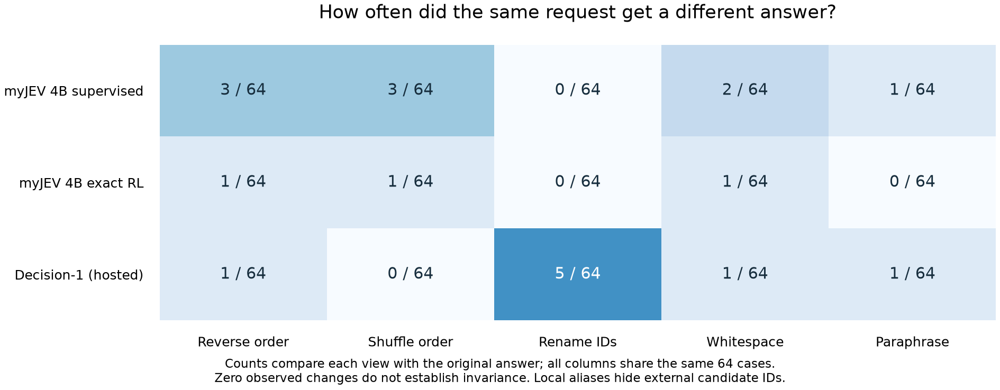

# Compare Microsoft Decision-1 with local myJEV

Microsoft describes Decision-1 as Qwen3.5-9B post-trained for single-pass decision scoring. That shares the pretrained backbone family and largest size in our original study. Its announcement reports broader task coverage and tests whether equivalent inputs keep the same decision. Those claims prompted this additional diagnostic. [Microsoft announcement](https://commandline.microsoft.com/microsoft-decision-1-model-foundry/)

The Foundry card lists text-only input, 32,768 tokens, supplied answer options, and public plus synthetic training data. The reviewed sources do not disclose a decision-head design, loss function or LoRA configuration. A shared backbone does not establish a shared implementation. [Model card](https://ai.azure.com/catalog/models/Microsoft-Decision-1)

To run our released models, start with the [quick start](quickstart.md). The comparison on this page is optional and uses a paid hosted service for Decision-1. It does not change the six myJEV releases or require retraining them.

## Keep the request set fixed

The [frozen protocol](../configs/decision-comparison-v1.json) uses all 1,000 BANKING77 calibration requests and a seed-42 sample of 64 official test requests. It records exact source hashes and test IDs before execution. Each model receives six versions of each test request:

| View | What changes | What the comparison checks |
|---|---|---|
| Original | Nothing | Reference selection and scores |
| Reverse | Candidate list order | Whether reversing choices changes the answer |
| Shuffle | A deterministic per-request permutation | Sensitivity to another ordering |
| Renamed IDs | Opaque identifiers; descriptions unchanged | Dependence on identifier spelling; outputs are mapped back |
| Whitespace | Spaces and newlines around fields | Sensitivity to surrounding formatting |
| Instruction paraphrase | An authored equivalent banking instruction | Sensitivity to task wording |

The paraphrase has no independent semantic-equivalence review. The six views share requests and remain separate in the report. Public benchmark exposure in Decision-1's training is unknown, so BANKING performance alone cannot establish transfer to unseen tasks.

The local prompt renders token aliases and descriptions, so external candidate IDs never reach Qwen. Renaming IDs checks that mapping; order changes also reassign aliases. The hosted service receives IDs through its API, with its internal rendering undisclosed.

All seven existing authored demos are included, with their expected answers excluded from model inputs. Five warmup calls precede calibration. The total is 1,396 calls per model: 5 warmups, 1,000 calibration requests, 384 test variants and 7 demos. The 4B supervised and RL releases supply the local comparisons.

## Compare the same probability quantity

The primary view uses the returned probability of the selected option. Local RL's learned correctness estimate and the hosted provider's separate confidence field are retained in the records, but neither substitutes for that common quantity. The provider field's interpretation is not established by this experiment.

The secondary view gives every model a positive temperature fitted only on calibration data. It uses log option probabilities, clipping zeros at 1e-12. The released supervised model already contains a temperature fit; this follow-up applies the same additional fitting opportunity to every delivered distribution. Positive scaling preserves option ranking. Test outcomes choose no model, temperature or threshold.

Coverage and empirical-error thresholds are selected on calibration and held fixed across all test variants. The report includes accepted counts and errors, Brier metrics, ECE with 15 equal-width bins, correctness AUROC and group-resampling intervals. Those intervals condition on each observed model; they do not measure training variation or service-version drift.

## What the fixed sample showed

The [saved report](../results/decision-comparison-v1/report.md) contains all views and demos. These are the original 64 test requests:

| Model | Correct / 64 | Accuracy | Native selection Brier | After equal temperature fitting |
|---|---:|---:|---:|---:|
| myJEV 4B supervised | 60 | 93.75% | 0.0348 | 0.0348 |
| myJEV 4B exact RL | 61 | 95.31% | 0.0420 | 0.0364 |
| Decision-1 through OpenRouter | 59 | 92.19% | 0.0586 | 0.0569 |

One additional correct answer changes accuracy by 1.5625 percentage points here. The conditional group-bootstrap 95% intervals are 87.50-98.44%, 90.63-100.00% and 84.38-98.44%, respectively. This small sample does not choose a new default model or establish a general ranking. All three models matched all seven authored demo expectations.



Decision-1 changed one answer under reverse order and none under the sampled shuffle. Opaque ID renaming changed five answers, three from correct to incorrect and two in the other direction. Both local models stayed unchanged under ID renaming, consistent with their alias mapping. Zero observed changes under a tested view do not establish invariance beyond those requests.

The fitted temperatures were 1.0000 for supervised myJEV, 3.2430 for RL and 0.9390 for Decision-1. The RL distribution became less concentrated. Its correctness Brier improved while 15-bin ECE rose from 0.0442 to 0.0561, showing why the metrics should remain separate. These are option probabilities; the released RL correctness policy is a different output.

At the native-score threshold chosen for 80% calibration coverage, supervised myJEV accepted 49/64 requests with zero observed errors. RL accepted 54/64 with two errors; Decision-1 accepted 55/64 with two. The zero-error group's one-sided binomial upper bound is still 5.93%. Its ordinary bootstrap interval is degenerate at zero because every observed accepted case is correct. Neither interval turns a calibration-selected threshold into a risk certificate.

The service returned `microsoft/microsoft-decision-1-20261009` and provider `Azure` throughout the run, observed from 04:10 to 04:20 UTC on 2026-10-10. All 1,396 calls succeeded without retries. Returned usage totalled 1,137,235 input tokens and $0.04776387, below the $2 client reservation. No immutable hosted-weight revision was supplied.

For the 64 original 77-candidate requests, p50/p95 was 214.66/216.76 ms for local supervised myJEV, 210.08/211.50 ms for local RL and 380.34/527.43 ms through OpenRouter. Local runs used separate A30 GPUs on the same host; these are the different timing paths described below. The short three-candidate serving measurements elsewhere use a different workload.

## Run the local comparisons

Install the reference environment and prepare the pinned BANKING77 splits using [training](training.md). The runner verifies their hashes. From the public repository root:

```bash
python scripts/run_decision_comparison.py --backend local \
  --artifact bahree/myJEV-4B \
  --revision 38f7cca5a8530483309f576b0c3dd1756bc27c33 \
  --output results/my-decision-comparison/myjev-4b

python scripts/run_decision_comparison.py --backend local \
  --artifact bahree/myJEV-4B-RL \
  --revision 0a9413105fc84cb500850059b641755890c4201b \
  --output results/my-decision-comparison/myjev-4b-rl
```

Each command loads one model. Use separate `CUDA_VISIBLE_DEVICES` values to run them concurrently on two GPUs. The tested host has 24 GB A30 cards. On one GPU, run the commands sequentially.

## Call Decision-1 through OpenRouter

OpenRouter provides access to the hosted model, so no Foundry deployment is needed for this path. Its Decisions API accepts `state` and typed questions at `/api/alpha/decisions`; the adapter maps our candidates to one `choice` question. It sends no expected label, group or evaluation ID. [OpenRouter interface](https://openrouter.ai/blog/insights/what-is-jev/)

Use an existing credential file containing `OPENROUTER_API_KEY`, or copy the empty [environment template](../examples/decision-comparison.env.example) to an ignored `.env.decision` file and fill it locally. The runner reads only that key. It never prints it or copies the credential file into results.

A dry run needs no key and makes no network calls:

```bash
python scripts/run_decision_comparison.py --backend openrouter \
  --output results/my-decision-comparison/decision-1
```

The frozen price assumption is $0.042 per million input tokens, with free output. Reserving 32,768 input tokens for every planned call gives $1.921253376 for the full run. The actual requests are shorter. The reservation is a client-side bound under that price and context assumption; it excludes price changes or additional provider fees. Check the [model listing](https://openrouter.ai/microsoft/microsoft-decision-1) before executing.

```bash
python scripts/run_decision_comparison.py --backend openrouter \
  --output results/my-decision-comparison/decision-1 \
  --env-file .env.decision --execute \
  --max-cost-usd 2 --max-requests 1400
```

Every attempted call is written before sending it. A failed call stops the run without an automatic retry, and its attempt remains in the budget. `--resume` continues a saved prefix with identical settings. Malformed distributions, unknown IDs, non-finite values and choices that disagree with the largest probability stop the run rather than being silently repaired.

## Inspect results and service identity

```bash
python scripts/summarize_decision_comparison.py \
  --root results/my-decision-comparison
```

`records.jsonl` contains text-free scores, expected labels, request hashes, timestamps, latency and returned service metadata. `run.json` records settings; `attempts.jsonl` retains attempted calls; `complete.json` hashes the complete result. The summary and Markdown report regenerate on CPU without credentials or model weights. To replay the published study, first run `python scripts/fetch_evidence.py --bundle decision` to restore its text-free records, then run the summarizer with its default root. A partial or failed run has no completed-model row.

OpenRouter says the model's weights can change while its API stays stable. The runner saves returned model/provider/version identifiers and request IDs where supplied. An immutable weight revision remains unknown unless the service exposes one. Repeating the same command later may therefore query different weights. [Version behavior](https://openrouter.ai/microsoft/microsoft-decision-1)

Local latency includes tokenization and result conversion with GPU synchronization. Hosted latency also includes network and provider queue time. Both use sequential calls, and neither is a concurrent-load benchmark. Provider cost and token usage are reported only when returned; missing billing metadata stays unknown. Local GPU ownership or rental cost is outside this measurement.

## Keep a dashboard copy

The [W&B evidence run](https://wandb.ai/amitbahree/myJEV/runs/yl271cxh) mirrors the completed report and text-free responses. Configure your own project using [tracking](tracking.md), then run `python scripts/sync_decision_evidence.py --upload --env-file .env.wandb` to upload the restored local evidence. Without `--upload`, the script prints only a file-and-hash manifest. This command makes no Decision-1 calls.
