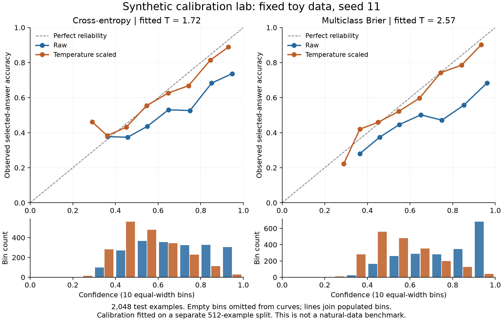

# What the experiments teach about decisions

The main result is a trade-off: exact reward optimization exceeded continued supervision in 4B BANKING77 selection accuracy on two of three seeds and in the mean, while supervised training followed by temperature scaling remained the preferred released starting point. Architecture, training objective, confidence semantics and operating costs are separate choices.

## Four probabilities that are easy to confuse

Consider an invented request whose normalized selection scores are billing 0.55, technical 0.30 and other 0.15. The selected answer is billing. A separate correctness estimate of 0.68 means that the model estimates a 68% chance its selected answer is correct. It does not rewrite the other selection scores into calibrated class probabilities.

Uncertainty about that estimate asks whether 0.68 itself is well supported. Our release does not return a statistically validated interval for that quantity. A probability that no supplied answer applies is another event: it requires an explicit target or separate detector and cannot be obtained by subtracting the highest selection score from one.

A normalized distribution always sums to one over the supplied options, even if every option is wrong. Selecting a `none` option is classification; declining to act because confidence is low is deferral. Evaluating both avoids confusing their failure modes.

## What the confidence policy optimizes

For a fixed input and candidate, let correctness C be Bernoulli with probability r. Let sampled confidence Q have mean mu and variance v, independently of the realized correctness conditional on that case. Then:

```text
E[(Q - C)^2] = (mu - r)^2 + r(1-r) + v
E[C - (Q - C)^2] = r^2 - (mu - r)^2 - v
```

At r=0.70, always reporting 0.70 yields expected reward 0.49. Randomly reporting 0.40 or 1.00 with equal probability has the same mean confidence, but variance 0.09 and expected reward 0.40. The policy's spread is penalized. It is not automatically a Bayesian distribution over the unknown correctness probability.

The calculation holds correctness probability fixed and omits KL. Actual training also changes the answer policy, shares parameters across requests, restricts confidence to 21 values and penalizes departure from a reference. Those features change the optimization problem. At inference the RL artifact reports the confidence policy's mean for its argmax answer, so sampled training reward and deployed deterministic behavior require separate checks.

The supervised loss already trains a scalar correctness head with BCE and the confidence policy with expected squared error. The `sft_brier` control adds Brier loss on the separate selection distribution. The released supervised variants use temperature-scaled selection probabilities as confidence. These distinctions prevent an apparent RL benefit from merely being a comparison against a weak confidence head.

The finite actions have known label-derived rewards. Exact optimization can therefore sum over them. Eight-sample REINFORCE estimates the same expectation with sampling variance; it is a controlled algorithm comparison, not a claim that this task requires long-horizon environmental interaction.

Regenerate the [checked arithmetic and cost example](../results/decision-lessons-v1/summary.json) with `python scripts/decision_lessons.py` using the included compact, text-free prediction inputs. The plot is a constructed example, not a trained-model measurement.

## Choosing whether to act

Suppose a wrong automatic route costs 100 arbitrary units, reviewing a request costs 2 units, and a reviewer still makes mistakes on 2% of the requests sent to review. Correct routes have zero incremental loss in this simplified model. Assume reviewer error is constant on deferred cases; this must be measured in a real system.

```text
automatic expected cost = 100 * (1 - q)
review expected cost    = 2 + 100 * 0.02 = 4
act automatically when q >= 0.96
```

The threshold comes from assumptions fixed in the teaching script, not optimization over test outcomes. Applied after the study to the released 4B checkpoint's saved BANKING test predictions, it accepts 1,182/3,080 requests (38.38%) with 1.10% observed error among accepted cases. Combining those actual model decisions with the assumed reviewer produces 2.887 simulated cost units per request, compared with 4 for always reviewing and 10.065 for always accepting.

This is not a measured human or LLM cascade, a dollar estimate, or a deployment guarantee. The perfect-reviewer variant accepts only 5.68% and has a simulated cost of 1.984 versus 2 for always reviewing. That tiny apparent gain shows how reviewer assumptions can dominate the conclusion. Human reviewers may have higher error specifically on the difficult cases the model defers; distributions and costs can also change.

## An efficient fixed-label classifier is a serious alternative

TF-IDF/logistic regression achieved 88.28% on the same official BANKING test split. Continued-supervised 4B averaged 89.23% across three seeds; its packaged seed reached 89.94%. The methods differ in tuning and exposure, so this is an operational comparison rather than a controlled estimate of one training method's benefit.

TF-IDF has a fixed trained taxonomy. It does not interpret a new set of candidate descriptions at request time. For a stable label set this can be an advantage: inexpensive CPU operation, smaller artifacts and fewer serving dependencies. The candidate-description interface earns its added cost only when that flexibility is useful and its transfer quality is measured.

The saved classifier is 12.8 MiB. The measured CPU p50/p95 was 0.503/0.540 ms per request; process peak RSS was 428 MiB including the Python stack. The [CPU baseline profile](../results/tfidf-serving-v1/summary.json) records vectorization plus classification on 512 frozen BANKING inputs, two CPU threads and concurrency one. Do not divide its time by Qwen's three-candidate HTTP benchmark to claim a speedup: inputs, candidate count and measurement boundaries differ. Whole-process CPU RSS and PyTorch allocated GPU memory are different accounting scopes.

GLiClass already provides an untouched pretrained-encoder control. Its pinned small checkpoint's 10.81% accuracy does not establish that pretrained encoders are inherently weak. The [ModernBERT control](../results/encoder-control-v1/report.md) shows why that broader conclusion would be wrong: a 149.7M-parameter fixed-taxonomy model reached 90.78% accuracy and 0.0555 temperature-calibrated Brier. It used one seed and 23,997 example exposures versus Qwen's 8,000, so this is an operational counterexample to needing a larger model for fixed labels, not a causal architecture comparison. Its weights are a separate local experimental artifact, not one of the six published myJEV releases.

## Broader decision systems and recent work

[Cloudflare Clef](https://blog.cloudflare.com/clef-decision-models/) combines Qwen representations, specialized schema heads and adaptation. This supports separating backbone ancestry from the output interface. Its multi-question outputs are a broader contract than myJEV's one selected candidate per request.

The [JEVal / InnerJev preprint](https://arxiv.org/abs/2610.03935) studies composed decisions and distillation of reasoning-endpoint distributions into a first-token readout. It motivates two different questions: can training transfer useful decision behavior, and does the resulting component improve complete workflows? Good component accuracy does not establish multi-step reliability. Repeated decisions also need task completion, accumulated errors and latency measured end to end.

The [37-dataset Jev evaluation](https://arxiv.org/abs/2609.37647) and [political-science comparison](https://arxiv.org/abs/2610.06625) motivate task-specific thresholds and an explicit distinction between online routing and offline batch annotation. Their figures are source-specific, not local myJEV measurements. The papers are recent preprints, and publisher model cards are disclosures rather than independent verification.

## What stronger evidence would require

Periodic validation is needed to study saturation or early stopping. Saved endpoint evaluations cannot recreate the missing curve. Archive correctness claims need reviewed labels and related-post grouping, not merely schema-valid machine responses. Scratch failure attribution needs controls that isolate tokenization, optimization, capacity and pretraining. Changing all of them together cannot identify a cause.

The companion [experiments guide](experiments.md), [scratch guide](scratch.md) and [archive card](datasets/blog-archive.md) distinguish completed follow-ups, prospective protocols and unresolved evidence. Distillation, more backbone families and a full Jev-compatible multimodal API are separate extensions.

## Run a small calibration lab on CPU

This lab separates two choices that can be confused in a large model: the loss used to train the classifier and the calibration fitted afterward. Cross-entropy is the ordinary supervised baseline; Brier uses squared probability error, the idea also used in our confidence reward. A synthetic problem lets us inspect the true probabilities as well as sampled labels. We can then test whether choosing a proper scoring rule is enough to produce calibrated predictions under a fixed training budget.

The [calibration lab](../scripts/calibration_lab.py) compares cross-entropy and class-summed Brier training on one fixed, four-class synthetic problem. Three seeds share initialization and minibatch order within each pair, with equal training exposure. Training, validation, calibration and test are separate. Temperature is fitted only on calibration NLL; validation is monitored without selecting checkpoints, and test never selects settings.

From the repository root, after installing the project and plotting dependency:

```bash
python -m pip install -e '.[research,test]'
python scripts/calibration_lab.py --output results/calibration-lab-rerun
python scripts/plot_calibration_lab.py --results results/calibration-lab-rerun
python -m pytest -q tests/test_calibration_lab.py
```

Use a new output directory for each run. The training script refuses to replace existing results. The [original report](../results/calibration-lab-v1/report.md), JSON metrics, training log and executed source snapshot preserve the first run, which took 5.57 seconds on one CPU thread. Its code hash matches the frozen protocol; a separate provenance note records the later overwrite guard.

Across these three seeds, raw Brier training produced worse test calibration than raw cross-entropy. Temperature scaling improved both. After scaling, Brier training had slightly lower multiclass Brier but slightly higher selected-correctness Brier than cross-entropy. Accuracy stayed unchanged by temperature scaling. This small example does not establish a winner on natural data or across tuning budgets.



The diagram uses seed 11 and ten equal-width confidence bins. Empty bins are omitted from curves; bars retain their counts. The diagonal marks agreement between confidence and observed accuracy. Connecting lines are a visual aid, not observations between bins. The saved figure provenance identifies its source JSON and generating script.

Three implementation details matter. First, calibration divides already-computed logits by a positive temperature; it never sends those logits through the input classifier again. Second, temperature inherits the logits' device and dtype and preserves their argmax. Third, 8% uniform label replacement changes only 6% of labels in expectation with four classes, because replacement can redraw the original label. The true observed distribution is `(1 - 0.08) * p_clean + 0.08 / 4`, and the generator returns it for oracle probability-error measurement.

Class-summed Brier evaluates the whole selection distribution. Selected-correctness Brier evaluates maximum selection probability against a correct/incorrect outcome, without a separate confidence head. Oracle MSE compares predicted probabilities with the known synthetic conditional distribution. These measure different things; neither the training objective nor temperature fitting guarantees better test calibration.
