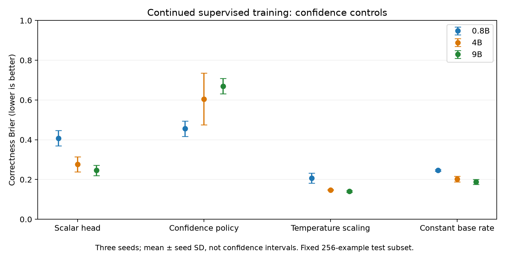
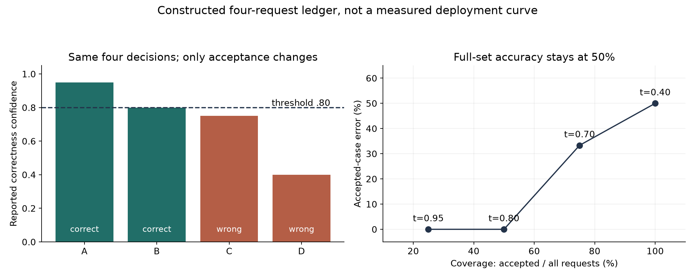

# Experiments and evidence

This guide maps the experiment results to the data and training conditions that produced them. For an explanation of what the results mean, start with the [Qwen findings](qwen-findings.md). The [training guide](training.md) defines the supervised and reward-based methods; [decision lessons](decision-lessons.md) works through confidence and error metrics.

Check answer accuracy first, then look at confidence and the errors among accepted requests. Transfer results show what changes on unfamiliar tasks. The ordinary releases report a calibrated selection probability; `-RL` releases report expected confidence from their policy head. The matched-calibration follow-up applies the same post-hoc procedures to all training methods so that these choices do not get confused.

There are two main sets of results. The short pilot used 100-update stages and a small test subset to check implementation behavior. The longer comparison used 4,000-update stages and the full official test set. Keep those conditions separate when reading the tables. The pilot alone does not establish that confidence-aware RL is better than supervision or calibration fitted after training.

## Completed longer comparison

All three sizes completed the 168,000-update schedule, 24 tuning evaluations and 36 main evaluations on all 3,080 official test examples. The [regenerable summary](../results/longer-v1/summary.md) reports three-seed means, seed SD, deployed confidence and temperature controls. Continued supervision leads mean accuracy at 0.8B; exact RL leads at 4B and 9B. Among released confidence configurations, continued supervision with temperature scaling has lower mean correctness Brier than native RL policies at every size. The [matched post-hoc follow-up](../results/review-calibration-v1/report.md) gives every method the same transforms and changes that conclusion: exact RL with selection temperature has a slightly lower 4B mean and lower 9B Brier on all three seeds. Paired conditional intervals and the local default recommendation are documented in the findings guide; neither establishes a production guarantee.

The short pilot below remains separate evidence with different exposure and test size.

## Scope of the short comparison

Three seeds (11, 22, 33) are used at each size. The initial supervised run receives 100 updates, with one example per update. Continued supervision and each RL branch receive another 100 updates from the seed-matched supervised checkpoint. All use the same fixed random 256-example BANKING77 official-test subset and 256 reserved calibration examples. The 0.8B and 4B runs use BF16 LoRA; 9B uses NF4 QLoRA.

The 45 pilot evaluations comprise 15 per size: seven seed-11 methods/ablations and four main methods for each of the other two seeds. The table below covers the replicated main comparison, not all ablations.

## Accuracy and policy confidence

| Size | Method | Mean accuracy | Seed SD | Policy-confidence Brier |
|---|---|---:|---:|---:|
| 0.8B | sft | 51.30% | 5.88% | 0.3309 |
| 0.8B | continued_sft | 57.29% | 3.91% | 0.4555 |
| 0.8B | exact | 55.73% | 4.10% | 0.2718 |
| 0.8B | sampled | 47.53% | 2.39% | 0.2537 |
| 4B | sft | 70.70% | 0.00% | 0.5076 |
| 4B | continued_sft | 71.88% | 3.73% | 0.6050 |
| 4B | exact | 71.61% | 3.63% | 0.2040 |
| 4B | sampled | 69.40% | 3.63% | 0.2139 |
| 9B | sft | 73.70% | 3.54% | 0.5626 |
| 9B | continued_sft | 75.00% | 2.56% | 0.6695 |
| 9B | exact | 72.14% | 2.00% | 0.1964 |
| 9B | sampled | 69.66% | 2.35% | 0.2132 |

Seed SD measures variation across three runs; it is not a confidence interval. Lower Brier is better. The policy column holds the confidence parameterization fixed across methods, but supervised artifacts normally deploy their scalar head. It is therefore only one confidence comparison.


## Compare against calibration, too

Continued supervision has the highest observed mean accuracy at every size. Exact RL is closer than sampled RL to that supervised control. These observations are conditional on short exposure, three seeds, and a small fixed subset.

In the pilot, without a matched post-hoc control, RL improved the weak supervised confidence policy. However, temperature-scaled supervised selection logits achieve lower mean correctness Brier than either RL policy in this pilot. The pilot did not fit the same post-hoc transform to RL. Improving only the weak policy baseline would be an incomplete argument for RL.



Constant base-rate confidence is included because a low Brier score alone does not imply useful discrimination or high accuracy. Operational evaluation also needs accepted-case error and coverage, with thresholds chosen on calibration data only.

## Other evidence

TF-IDF/logistic regression reaches **88.28% accuracy** on all 3,080 official test examples. Temperature scaling reduces correctness Brier from **0.1246 to 0.0703**, without changing argmax decisions. It trains on the complete training partition, so exposure and test-set size differ from the neural pilot.

The completed baseline records include the following results. These are separate interface/exposure controls, not a matched leaderboard:

| Control | Test examples | Accuracy | Confidence source |
|---|---:|---:|---|
| Untouched Qwen 0.8B | Fixed 256-example subset | 15.23% | Selection-score proxy |
| Untouched Qwen 4B | Same subset | 61.33% | Selection-score proxy |
| Untouched Qwen 9B | Same subset | 54.69% | Selection-score proxy |
| GLiClass small v1.0 | Full 3,080 | 10.81% | Maximum normalized class score |

GLiClass uses revision `21edefaf7951f68c68c505f9139ba536d3b448f7` with supplied label descriptions and no task-specific training here. Its weak result is specific to this checkpoint and interface, not a claim about all generalist classifiers. Low Brier from low confidence is not evidence of a useful selector. The untouched measurements belong to the pilot subset; they do not establish the full-test fine-tuning effect. Source records live under `results/untouched-*-v2-evaluation/` and `results/gliclass/`.

The initial 0.8B transfer/robustness work is limited. The frozen expanded study covers all three sizes and seeds for continued supervision and exact RL. The three-seed 4B NF4 SFT control completed at the same 4,000-example exposure as the BF16 controls, after a 100-update fit pilot. It isolates a training configuration difference, including nonquantized dtype, rather than proving that every scale effect is caused by capacity alone.


## Find the underlying evidence

The [results index](../results/README.md) separates browsable reports from optional evidence downloads. Restore the relevant bundle before replaying an analysis that reads individual predictions. Inference does not use these files.

| Evidence | Location |
|---|---|
| Full-test longer comparison | [summary.json](../results/longer-v1/summary.json) |
| Conditional full-test paired contrasts | [paired-analysis.md](../results/longer-v1/paired-analysis.md) |
| Per-seed deltas beside conditional intervals | [seed report](../results/review-seeds-v1/report.md) |
| Matched calibration follow-up | [calibration report](../results/review-calibration-v1/report.md) |
| Punctuation-normalized overlap sensitivity | [overlap report](../results/review-overlap-v1/report.md) |
| Historical pilot summary | [final-study-table.json](../results/final-study-table.json) |
| Historical pilot paired contrasts | [paired-comparisons.json](../results/paired-comparisons.json) |
| Historical pilot seed-11 metrics and predictions (download `pilot`) | `results/pilot-{size}-{method}-evaluation/` |
| Historical pilot seed-22/33 metrics and predictions (download `pilot`) | `results/three-seed-{size}/seed-{seed}/{method}/` |
| Temperature and constant controls | Corresponding `*-posthoc/` directories |
| Training manifests and update records | [artifact-manifests](../results/artifact-manifests/) |
| HTTP benchmark measurements | [docker-size-validation](../results/docker-size-validation/) |
| Full observed GPU activity | [telemetry chart](../results/gpu-telemetry-20261004T205942Z/gpu-activity.png) |

Per-run reports contain macro-F1, correctness/selection Brier metrics, confidence discrimination, disclosed ECE bins, reliability values, and calibration-selected coverage/error results. Paired bootstrap intervals are conditional on the observed seeds and are not adjusted for multiple comparisons. Consult [the protocol](protocol.md) before treating pilot numbers as production error guarantees.

## Reproduce figures or train new runs

From the repository root after installing the locked environment:

```bash
python3 scripts/fetch_evidence.py --bundle pilot
.venv/bin/python scripts/plot_study.py
.venv/bin/python scripts/summarize_study.py
.venv/bin/python scripts/paired_comparisons.py
```

These commands use the restored evaluation evidence and require no model download. Run them in a writable checkout; they regenerate output files.

For new training, begin with the supervised 0.8B artifact in the [quick start](quickstart.md). Then, in a separate experiment checkout if you want to preserve the published results unchanged:

```bash
mkdir -p results
CUDA_VISIBLE_DEVICES=0 .venv/bin/python scripts/pilot_suite.py 0.8b
CUDA_VISIBLE_DEVICES=0 .venv/bin/python scripts/three_seed_pilot.py 0.8b
```

These runners skip completed artifacts/evaluations. An existing published `results/` tree will therefore cause matching evaluations to be skipped: move the published results aside to a backup before collecting fresh measurements. Keep original evidence and new runs distinct. Adapt the size argument and supervised artifact for 4B or 9B.

## Serving measurements

Local GPU container checks passed at all three sizes. Warm concurrency-one HTTP p50/p95 were 60.1/63.7 ms (0.8B), 78.6/81.0 ms (4B), and 101.2/103.7 ms (9B). Each check used 40 short three-candidate requests, cached backbones, and an idle target GPU while another GPU was still training. These are implementation measurements, not an isolated-host service-level guarantee.

Read [hosting](hosting.md) for limits, readiness, queues, precision, and deployment details. The replicated precision controls and representative serving measurements have their own recorded protocols; the [scope guide](roadmap.md) separates their findings from untested research extensions.

## Completed extension analysis

The [paired extension report](../results/extension-analysis-v1/report.md) analyzes precision and transfer using shared example groups. Restore `python scripts/fetch_evidence.py --bundle controls`, then reproduce with `python scripts/analyze_extensions.py`; the public compact inputs omit request text. All 36 transfer/robustness jobs and six final local serving candidates completed. [Model selection](models.md) explains the calibrated 4B supervised starting recommendation and alternatives.

## From counts to an operational decision

If a calibration-selected threshold accepts 80 of 100 test requests and four accepted answers are wrong, coverage is 80% and accepted-case error is 5%. The denominator changes when you defer. Counts and uncertainty belong alongside percentages, especially for small accepted sets. [Decision lessons](decision-lessons.md) derives the metrics, paired contrasts and cost calculations; the [CPU lab](../results/calibration-lab-v1/report.md) tests confidence against a known synthetic probability distribution.

Run `python scripts/training_mechanics_demo.py` for reward arithmetic and follow the [worked learning route](walkthrough.md) for the connection to training and deployment. The later [seven demos](../results/demos-v1/report.md) are executable examples, not a test-set accuracy estimate. The [ModernBERT control](../results/encoder-control-v1/report.md), [SST-2 transfer](../results/sst2-transfer-v1/report.md) and [failure casebook](../results/failure-casebook-v1/report.md) disclose their separate interfaces, budgets and selection procedures.



The ledger above uses constructed counts for teaching; measured results remain in their separately named reports.

## Replay the matched calibration views

The compact inputs contain labels, scores and IDs, not request text. No model download is required. To preserve the published files, use a disposable checkout:

```bash
git clone --local . /tmp/myjev-calibration-replay
cd /tmp/myjev-calibration-replay
python3 scripts/fetch_evidence.py --bundle calibration
# Use the locked environment created from the original checkout.
OMP_NUM_THREADS=2 MKL_NUM_THREADS=2 python scripts/review_calibration.py --from-compact
git diff --exit-code -- results/review-calibration-v1
```

The final command checks byte identity against the committed reports. Select a fresh destination if that example directory already exists. The [evidence guide](../results/longer-v1/README.md) explains why RL scalar diagnostic files are not trained RL confidence estimates.
