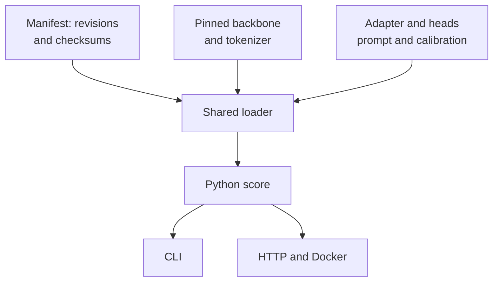
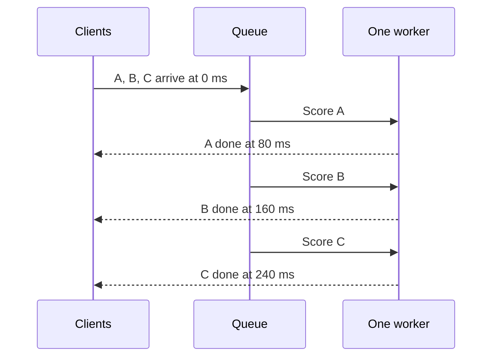

# Run inference locally and in Docker

Start with [myJEV-4B on Hugging Face](https://huggingface.co/bahree/myJEV-4B) to score a request without training a model. This guide shows the same call through Python, the command line, HTTP and the published [Docker image](https://hub.docker.com/r/amitbahree/myjev). Use the [quick start](quickstart.md#install-and-test) to install the Python environment, or go straight to the Docker section below.

There are six trained releases: 0.8B, 4B and 9B, each with a supervised and an RL variant. The sizes refer to the approximate billions of parameters in the Qwen backbone. The loader downloads that backbone as well as the smaller adapter and confidence-head files from Hugging Face. All six releases passed output-equivalence checks across Python, CLI, HTTP and the GPU container. The default is the supervised 4B release with temperature calibration; the [findings](qwen-findings.md) explain that choice.

The [model guide](models.md) explains why both training variants are available and how to choose between them. Both use the same request interface; the `-RL` suffix identifies reward-based training.

GitHub supplies the code and examples, the Hugging Face Hub supplies the trained files, and Docker Hub supplies the packaged software environment. The Docker image contains no model weights. Its loader obtains the selected release and backbone at startup and can reuse them from a cache. Keeping one inference implementation behind all four entry points lets us check that serving preserves the decisions and confidence we evaluated.

## What the adapter saves and what inference still costs

Loading the model requires the **backbone, adapter, confidence heads and calibration**. LoRA stores a small weight update while keeping the pretrained weights frozen during training. That reduces the trainable parameters and optimizer state, but the pretrained layers still run for every request. The [PEFT explanation](https://huggingface.co/docs/peft/main/en/conceptual_guides/lora) shows how the update is combined with the original layer.

A local completed 9B supervised artifact (`longer-v1/9b/main/seed-11/sft`) occupied about 7.6 MiB for the adapter directory and 4.1 MiB for `heads.safetensors`, measured with `du -h`. Those approximate disk sizes exclude the backbone download. Parameter counts and VRAM are separate quantities. The separately pinned backbone is still required. Sharing its cache avoids downloading a new full backbone for every adapter.

One forward pass reads the whole input and computes the decision scores. Avoiding an autoregressive output loop saves repeated decoding work, but input processing remains substantial, especially with long documents or many candidate descriptions. The completed continued-SFT candidates measured warm HTTP p50 latencies of 57.48, 82.18 and 115.09 ms at 0.8B, 4B and 9B on a short three-candidate request. See [benchmark conditions and p95](hosting.md#completed-candidate-validation-and-local-default). The measurements apply to those workloads and do not establish a service guarantee.

No matched Jev speed comparison has been run. Different GPUs, prompt lengths, candidate counts, batching, server overhead and optimized kernels prevent interpreting another provider's latency as a direct architecture comparison. GPU utilization alone does not establish efficiency.

Merging a compatible adapter into its backbone can remove separate adapter operations; it does not shrink the backbone. Merging and quantization require output-equivalence and calibration checks before release. Kernel/backend optimization and distillation into a smaller model would need further measurements. The current reference backend prioritizes correct shared behavior across Python, CLI and HTTP.

## One interface, four entry points

An artifact includes pinned backbone/tokenizer revisions, LoRA adapters, confidence heads, calibration and a manifest. Every entry point uses the same loader and one backbone forward pass. The returned selection scores rank candidates; correctness confidence estimates whether the selected answer is right. They have different meanings.

Python:

```python
import json
from pathlib import Path
from myjev import DecisionModel

model = DecisionModel.load("bahree/myJEV-4B",
                           revision="38f7cca5a8530483309f576b0c3dd1756bc27c33")
request = json.loads(Path("examples/request.json").read_text())
print(model.score(request))
```

The first load downloads the release files and the separately pinned backbone/tokenizer. These repositories are not self-contained merged models and require the custom loader. Local artifact directories remain supported.

CLI with the same public release:

```bash
.venv/bin/myjev score --artifact bahree/myJEV-4B \
  --revision 38f7cca5a8530483309f576b0c3dd1756bc27c33 --input examples/request.json
.venv/bin/myjev serve --artifact bahree/myJEV-4B \
  --revision 38f7cca5a8530483309f576b0c3dd1756bc27c33
```

CLI, for a locally trained artifact, one request or a JSONL batch:

```bash
.venv/bin/myjev score --artifact artifacts/pilot-0.8b/artifact --input examples/request.json
.venv/bin/myjev score --artifact artifacts/pilot-0.8b/artifact --input requests.jsonl --jsonl
```

HTTP, in a separate terminal:

```bash
.venv/bin/myjev serve --artifact artifacts/pilot-0.8b/artifact
curl -fsS http://127.0.0.1:8000/readyz
curl -fsS http://127.0.0.1:8000/score \
  -H 'Content-Type: application/json' --data-binary @examples/request.json
```

Readiness requires model loading and warmup. Health is available at `/healthz`. The service binds locally by default, rejects oversized inputs instead of truncating, and uses a bounded queue with overload/timeouts. See [hosting](hosting.md) for remote HTTPS authentication and queue behavior.

## GPU Docker

Use the published Linux `amd64` image on a host with a compatible NVIDIA driver and NVIDIA Container Toolkit. A 24 GB A30 is the tested GPU class. No local Python installation or training run is required.

```bash
export MYJEV_IMAGE=amitbahree/myjev@sha256:55c78ef13329ab35712e27c9815eff94c17ba1f5fc145bd58eb705d0f16e1f6d
docker pull "$MYJEV_IMAGE"
mkdir -p .cache/huggingface
docker run --rm --name myjev --gpus device=0 \
  -p 127.0.0.1:8000:8000 \
  -v "$PWD/.cache/huggingface:/cache/huggingface" \
  -e MYJEV_ARTIFACT=bahree/myJEV-4B \
  -e MYJEV_REVISION=38f7cca5a8530483309f576b0c3dd1756bc27c33 \
  "$MYJEV_IMAGE"
```

Once `/readyz` succeeds, send the HTTP request shown above. Stop from another terminal with `docker stop myjev`. First startup downloads the artifact and its separately pinned backbone; the image itself contains no weights. Keep the cache volume for subsequent starts. The image occupies about 10.5 GB as reported by Docker on this host (compressed registry layers total 3.48 GB), plus the separately downloaded models. Our published-image check reused cached image layers and model files; it is not a fresh-machine download-time measurement.

The [publication receipt](../results/container-registry-v3/publication.json) records the immutable digest, anonymous pull and exact GPU HTTP/host response match. The shorter tag `amitbahree/myjev:0.1.3` refers to this release; use the digest for reproducibility. [Docker Hub overview](../deploy/README.container.md) supplies a self-contained request example and runtime details.

To build from the checked-out source instead, run `docker build -t myjev:local .`. For a locally trained artifact, the Compose path remains:

```bash
export MYJEV_ARTIFACT_HOST="$PWD/artifacts/pilot-0.8b/artifact"
export MYJEV_CACHE_HOST="$PWD/.cache/huggingface"
docker compose -f deploy/compose.yaml up --build
# Stop the Compose service when finished.
docker compose -f deploy/compose.yaml down
```

One process loads one selected model. Preserve the pinned backbone cache and mount a complete artifact when using Compose. An adapter alone does not include its backbone. Both examples bind to host loopback; authenticated remote access needs the proxy setup in [hosting](hosting.md).

## Troubleshooting and release checks

| Symptom | Check |
|---|---|
| GPU is unavailable in the container | Host driver, NVIDIA Container Toolkit and `--gpus` access |
| Readiness does not succeed | Model-loading/warmup logs, artifact path, backbone cache and free VRAM |
| First model call needs a compiler | Use the repository image, which includes `gcc` and `libc6-dev` |
| Python dependencies disappear in a wrapper | Invoke `.venv/bin/python` directly; do not resolve its symlink to system Python |
| HTTP 429 or 504 | Queue capacity, request length and timeouts; failed requests are not fast inference |
| Backbone downloads again or disk fills | Set the same `HF_HOME` used for training; for fully cached pinned models use `HF_HUB_OFFLINE=1`. Preserve the cache and inspect interrupted downloads before cleanup |
| Backend output differs | Recheck custom heads, precision, pinned revisions and calibration |

Before releasing a checkpoint, repeat save/reload and Python/CLI/HTTP/Docker equivalence on that checkpoint and image. Measure warm p50/p95, throughput, peak VRAM, cold start and overload behavior on representative inputs. The completed scoring-versus-generation controls and their format failures are described in [the benchmark results](hosting.md#completed-candidate-validation-and-local-default).

The [Hugging Face custom-container recipe](hosting.md#hugging-face-inference-endpoints-recipe) remains unexecuted. Publishing weights does not create a running endpoint. Use the published immutable image digest above in a managed-container configuration.

## Try seven original requests

The first request above routes a duplicate charge to billing. The demo file builds on it with an app crash, an unrelated hiking question, two refund requests on either side of a rule's boundary, a misleading quoted instruction, and a short how-to post. These are seven inputs to the same model; each supplies the instructions and choices for its task.

```bash
.venv/bin/python scripts/run_demos.py > responses.jsonl
.venv/bin/myjev score --artifact bahree/myJEV-4B \
  --revision 38f7cca5a8530483309f576b0c3dd1756bc27c33 \
  --input examples/demo-requests.jsonl --jsonl > cli-responses.jsonl
```

The runner loads the pinned 4B model once and writes one response per input line, in the same order. The file is JSONL, meaning one JSON object per line. Run `head -n 1 responses.jsonl | .venv/bin/python -m json.tool` to inspect the first answer. The [demo walkthrough](../results/demos-v1/report.md#what-each-request-asks) explains every request, its expected answer, and the recorded outputs for both sizes. You can read it without a GPU or download.

All seven default Python and CLI responses were identical. The 0.8B model confidently approved a day-14 refund when the supplied rule allowed fewer than 14 days; that mistake remains in the report. These examples help explain the interface, but do not estimate general accuracy. Expected answers are kept separately and are never sent to the model.



The 0.1.2 container was built through the public root Dockerfile as `myjev:0.1.2-review`; [hosting](hosting.md#public-source-rebuild-and-empty-model-cache-follow-up) records that build and its recovery from a disk-full unpack. The validation patch release uses the same published dependency layers through `deploy/Dockerfile.patch`. Build the root Dockerfile for a complete installation from the pinned Python base.



## Validation patch release

Image **0.1.3** rejects non-finite request numbers (`NaN`, `Infinity`, `-Infinity`) with HTTP 422, including the `/generate` alias. Versions through 0.1.2 could return 500 while serializing their validation errors; invalid requests still never reached the model worker. The patch returns only error type, location and message, without reflecting request content.

`deploy/Dockerfile.patch` applies the reviewed source to the immutable public 0.1.2 dependency image. The root Dockerfile remains the full-build path. BuildKit attempted an additional base unpack and ran out of disk; Docker's legacy builder reused the installed layers successfully. The [build provenance](../results/container-registry-v3/provenance.json) preserves both attempts. The build patches source while retaining the earlier dependency image. The service has a 15-minute health-start grace period, and the research container runs as root.

The [GPU check](../results/container-registry-v3/gpu-check.json) verifies installed Python-file hashes, CLI/HTTP/host equality, managed routes, non-finite 422 responses and the 413 body limits. Its readiness time is one populated-cache observation. First-download conditions and repeated-start variability require separate checks. The 203.6-second empty-cache measurement belongs to 0.1.2 and remains labelled with that version.

### Cache conditions in the validation receipts

The populated-cache GPU checks mounted the model cache read-only with `HF_HUB_OFFLINE=1`. Reader startup examples allow writes and downloads so missing pinned files can be fetched. Enable offline mode only after those files are present. Queue-size and timeout environment variables are optional overrides; the examples without them use the server defaults. The historical 0.1.2 empty-model-cache run is a separate measurement.
