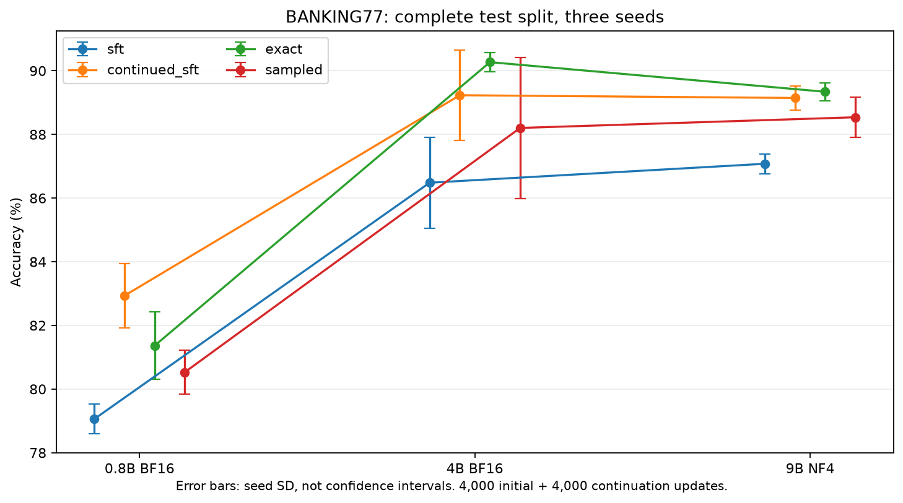
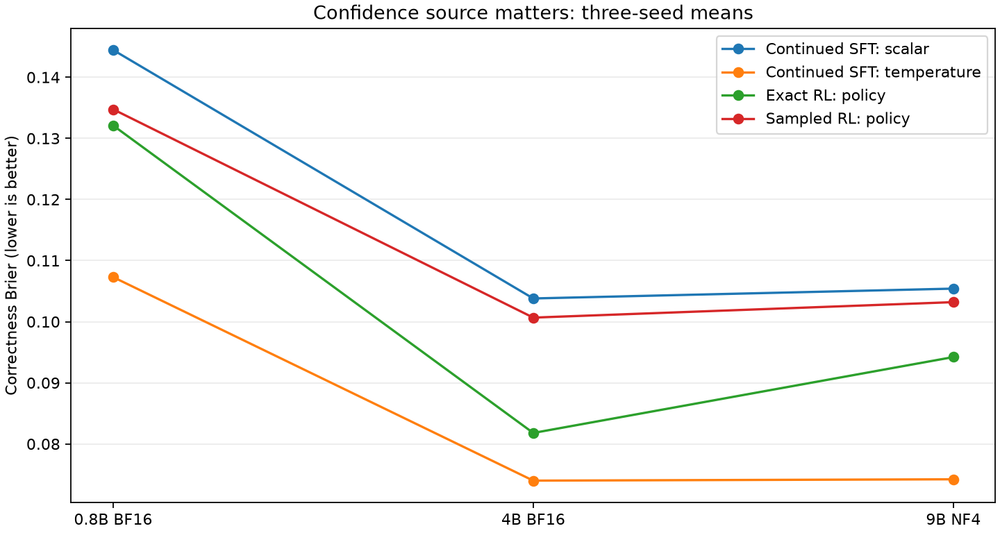
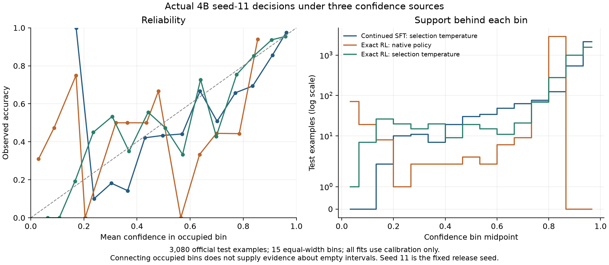
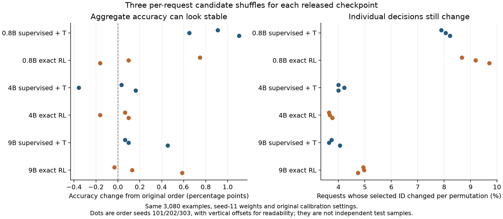

# What the completed Qwen study taught us

Does training with a reward produce better decisions than learning from labelled answers? This guide reads the Qwen results with that comparison in mind, then checks confidence, task changes and model size. Start with [decision lessons](decision-lessons.md) for worked definitions of the metrics, or [training](training.md) for the experiment setup.

The study contains 24 tuning runs, 36 main runs and 168,000 optimizer updates. All main evaluations use the 3,080 official BANKING77 test examples; calibration uses 1,000 separate examples to fit confidence adjustments and thresholds. BANKING77 is a collection of customer messages labelled with 77 banking intents. **SFT** means supervised fine-tuning from labelled answers; **RL** means reinforcement learning from a reward. Three random seeds repeat the main comparisons so we can inspect variation between training runs.

## The inexpensive baseline belongs in the decision

TF-IDF/logistic regression achieved **88.28%** BANKING accuracy, compared with **89.23%** for the three-seed continued-supervised 4B mean. The packaged 4B seed reaches 89.94%. These are different comparisons: exposure and tuning differ, and TF-IDF cannot interpret request-supplied new categories. For a stable taxonomy, its small accuracy gap makes it a serious operational alternative. The subsequent [149.7M-parameter ModernBERT control](../results/encoder-control-v1/report.md) reached 90.78% accuracy and 0.0555 correctness Brier after 23,997 example exposures, one seed and validation-selected checkpointing. It used more training exposure than Qwen and a fixed 77-label head. That limits causal comparisons but strengthens the practical case for trying a small adapted encoder first when the taxonomy is stable. The [worked decision guide](decision-lessons.md) and [CPU profile](../results/tfidf-serving-v1/summary.json) explain when that distinction matters.

## The result depends on the control

| Size | Initial SFT | Continued SFT | Exact RL | Sampled RL |
|---|---:|---:|---:|---:|
| 0.8B | 79.06% | 82.93% | 81.36% | 80.53% |
| 4B | 86.48% | 89.23% | 90.27% | 88.20% |
| 9B | 87.08% | 89.15% | 89.34% | 88.54% |

These are three-seed mean accuracies. Initial SFT uses 4,000 updates; each continuation adds 4,000 from the same seed-matched initial model. The fair test of an RL benefit is therefore against continued SFT, which receives the same additional examples. At 0.8B, comparing exact RL only with initial SFT would suggest an improvement, while continued SFT does better with the same extra exposure.



The compact [paired evidence](../results/longer-v1/paired-analysis.md) resamples test groups, pairing examples across methods and averaging the three observed seeds:

| Exact RL minus continued SFT | Seed 11 / 22 / 33 deltas (pp) | Mean (pp) | Seed SD (pp) | Conditional group 95% interval (pp) |
|---|---|---:|---:|---|
| 0.8B | -1.75 / -2.86 / -0.10 | -1.57 | 1.39 | [-2.20, -0.95] |
| 4B | +0.62 / -0.19 / +2.69 | +1.04 | 1.49 | [+0.56, +1.49] |
| 9B | -0.29 / +0.23 / +0.65 | +0.19 | 0.47 | [-0.36, +0.71] |

These exploratory intervals are conditional on the three seeds and unadjusted for multiple comparisons. They are not uncertainty over every possible initialization. Exact RL exceeded continued supervision at 4B on two of three seeds and on the mean. Its test-resampling interval excludes zero, while the seed deltas cross zero. At 0.8B continued supervision leads on all three seeds. The 9B interval includes zero. The [seed report](../results/review-seeds-v1/report.md) exposes both sources of variation; three training seeds do not establish the result for future runs. More capacity did not establish a monotonic advantage, and 9B's NF4 precision differs from BF16 at the smaller sizes.

## Calibration is not settled by accuracy

| Size | Continued SFT, temperature confidence | Exact RL, policy confidence | Sampled RL, policy confidence |
|---|---:|---:|---:|
| 0.8B | 0.1073 | 0.1321 | 0.1347 |
| 4B | 0.0740 | 0.0818 | 0.1007 |
| 9B | 0.0742 | 0.0942 | 0.1032 |

Mean correctness Brier, lower is better. Temperature scaling fits the selection logits on calibration data and uses the selected-option probability as confidence. RL reports the expected value of its candidate-conditioned confidence policy. The two configurations therefore report different confidence sources.



Temperature-scaled continued supervision has lower Brier than the native RL policy in these released configurations. This compares deployable configurations with different confidence sources and unequal post-hoc treatment. It does not isolate a training-method advantage. The matched follow-up below changes that interpretation.

Operational ranking can differ from Brier. At the calibration-selected 80% coverage target, 4B exact RL achieved mean test coverage of 83.14% with 3.81% accepted-case error; temperature-scaled continued SFT achieved 82.24% with 4.22% error. The achieved coverages differ, limiting the comparison to descriptive operating points without an equal-coverage significance claim. The full summary preserves thresholds and per-run uncertainty through its source files. An empirical calibration error target is not a production risk guarantee.

## Give every method the same calibration opportunity

The exploratory follow-up froze four views before fitting: native learned correctness confidence, raw selected probability, selection logits with a fitted temperature, and a one-parameter binary temperature on the learned correctness estimate. All four training methods and all three seeds receive identical calibration procedures on the reserved 1,000 examples. Original test outcomes had already been inspected, making this an exploratory follow-up rather than a preregistered confirmation. No new model training or release selection was performed.

| Size | Continued SFT, selection temperature | Exact RL, selection temperature | Sampled RL, selection temperature | Exact minus continued SFT by seed 11 / 22 / 33 |
|---|---:|---:|---:|---|
| 0.8B | 0.1073 | 0.1184 | 0.1207 | +0.0155 / +0.0143 / +0.0035 |
| 4B | 0.0740 | 0.0733 | 0.0852 | -0.0014 / +0.0091 / -0.0098 |
| 9B | 0.0742 | 0.0681 | 0.0772 | -0.0065 / -0.0056 / -0.0062 |

These are correctness Brier scores, where lower is better. With equal selection-temperature fitting, exact RL has a slightly lower mean at 4B with mixed seed deltas, and a lower value at 9B on all three seeds. Continued supervision remains ahead at 0.8B. The conclusion changes when the fitting opportunity is matched: supervised training plus calibration no longer leads at every size.

These selection-temperature means also differ in ECE and error ranking. ECE uses fifteen equal-width bins; AUROC measures how well confidence separates correct from incorrect decisions.

| Size | ECE: continued / exact / sampled | AUROC: continued / exact / sampled |
|---|---|---|
| 0.8B | 0.0454 / 0.0424 / 0.0415 | 0.8424 / 0.7797 / 0.7940 |
| 4B | 0.0370 / 0.0183 / 0.0247 | 0.8698 / 0.7617 / 0.7820 |
| 9B | 0.0420 / 0.0250 / 0.0181 | 0.8834 / 0.8747 / 0.8263 |

Lower Brier or ECE does not necessarily give better error ranking or lower accepted-case error. All three metrics describe the same fixed exploratory view; none was used to pick a new release.

For the separate learned estimate, the same binary log-odds temperature gives continued-SFT / exact-RL mean Brier of 0.1202 / 0.1425 at 0.8B, 0.0848 / 0.0796 at 4B and 0.0877 / 0.0933 at 9B. The 4B exact-minus-continued deltas are +0.0018 / +0.0004 / -0.0179 for seeds 11 / 22 / 33: only seed 33 drives the lower exact-RL mean. The map minimizes negative log likelihood on calibration data. Test Brier sometimes worsens after fitting. Equal fitting opportunities do not guarantee equal suitability for the different confidence sources.

At 4B, exact RL's selection-temperature confidence has lower Brier than its native policy, but lower correctness AUROC (0.7617 versus 0.8685). Its error ranking changes along with its probability quality. A lower Brier alone is insufficient for selecting a deferral policy. The [complete report](../results/review-calibration-v1/report.md) includes initial SFT, all four views, reliability bins, per-seed metrics and empirical operating points. Its 18 supervised selection-temperature controls reproduce the original Brier results within 1e-12. Text-free compact predictions allow reproduction without a model download.

The releases keep their original calibration settings. Choosing a replacement from whichever test column looks best would make the test part of the selection procedure. A deployment change needs a declared objective and an independent workload evaluation.



The figure shows seed 11, all 3,080 test rows and fifteen bins. Low-count bins are noisy; their jagged shape is not a population calibration curve. The table above retains all seeds.

## Sampling did not help this finite-action experiment

Sampled RL had lower mean accuracy than exact RL at every size, by 0.83, 2.07 and 0.80 percentage points respectively. The paired conditional intervals favor exact optimization. Sampled accuracy is lower in eight of nine size/seed pairs; 0.8B seed 22 is the exception, ahead by 0.32 pp. At 4B, sampled accuracy also varied more across seeds: SD 2.21 percentage points versus 0.29 for exact RL.

Sampling noise could contribute to that gap, but the study does not isolate it from confidence-policy initialization, learning-rate selection or the fixed schedule. We can compute every action’s reward here, so exact optimization is available as a control. In a task with too many actions to enumerate, sampling would still be necessary.

## What we learned about scale, data and resources

- Continued SFT at 0.8B reaches 82.93% accuracy. The short pilot and longer study changed exposure, tuning, continuation handling and evaluation size, so their difference is not a clean causal estimate of training duration alone.
- The best observed mean accuracy, 90.27%, belongs to 4B exact RL. That result makes 4B exact RL a candidate for further evaluation before a production choice. We did not perform a paired cross-size superiority test here, and precision complicates the 9B comparison.
- TF-IDF/logistic regression reached 88.28% on the same official test split using the full training partition. Exposure and tuning differ, so it is not a matched neural training control, but this inexpensive fixed-taxonomy baseline remains operationally relevant.
- The approximately one-epoch initial-plus-continuation budget supports a matched study; it does not prove convergence. Endpoint evaluations cannot reconstruct a validation learning curve or a principled early-stop decision.
- LoRA adapters require their backbone to execute inference. Final comparisons must include the pinned backbone, heads, precision, input lengths and HTTP overhead. Final-checkpoint measurements cover six packaged candidates; they still do not establish Jev-equivalent performance.

## Completed transfer and precision follow-ups

All 36 frozen transfer/robustness jobs completed, covering continued supervision and exact RL at three sizes and three seeds. CLINC diagnostics cover the fixed subsets recorded in the protocol. Temperature controls reuse BANKING77 calibration without fitting on transfer outcomes.

| Size | Continued SFT near / distant accuracy | Exact RL near / distant accuracy | Continued SFT / exact explicit OOS-none accuracy |
|---|---:|---:|---:|
| 0.8B | 81.51% / 68.62% | 81.64% / 67.45% | 0.39% / 3.52% |
| 4B | 87.50% / 80.86% | 86.72% / 79.56% | 76.30% / 59.38% |
| 9B | 88.15% / 83.46% | 86.59% / 81.90% | 60.16% / 58.07% |

The BANKING accuracy benefit does not establish an RL transfer benefit. The 4B near/distant paired intervals include zero; its exact-minus-supervised explicit OOS-none difference is -16.93 pp with a conditional 95% group interval [-19.53, -14.19]. The exact-RL OOS-none accuracies are 74.61%, 21.88% and 81.64% for seeds 11/22/33: this substantial initialization sensitivity is not represented by a bootstrap conditional on those seeds. None-option classification is distinct from deferral. On the OOS-deferral cohort, calibrated 4B supervision accepts 4.17% of requests at its original BANKING threshold, versus 7.68% for exact RL; all accepted answers there are wrong by construction. Changing coverage under shift prevents treating this as a matched-coverage guarantee.

The replicated 4B NF4 SFT control also completed. NF4-minus-BF16 accuracy differs by -1.20, +0.78 and +2.86 pp across seeds. The mean is +0.81 pp, with conditional group interval [+0.28, +1.35]; Brier difference is +0.0002 [-0.0049, +0.0053]. The mixed per-seed results limit the finding to these three trained checkpoints. Nonquantized modules also changed dtype. It does not isolate precision effects on 9B or RL.

The [paired extension report](../results/extension-analysis-v1/report.md) includes compact text-free inputs, source hashes and regeneration commands. Intervals average the observed seeds before resampling shared example groups; they are exploratory and do not include uncertainty over new training seeds or new task families.

## Order randomization did not produce invariant decisions

All 18 frozen permutation checks completed: three orders per released seed-11 checkpoint, 3,080 examples per order, unchanged weights and calibration. Across the three per-request seeded permutations, 0.8B changes selected ID on 7.89-9.71% of requests per permutation across its two variants. The larger models change on 3.64-4.97% per permutation. Aggregate accuracy moves less because correct and incorrect answers can exchange places.

| Size | Release | Original accuracy | Shuffled accuracy range | Requests changing selected ID |
|---|---|---:|---|---|
| 0.8B | Continued SFT + temperature | 83.90% | 84.55% to 85.00% | 7.89% to 8.21% |
| 0.8B | Exact RL | 82.14% | 81.98% to 82.89% | 8.67% to 9.71% |
| 4B | Continued SFT + temperature | 89.94% | 89.58% to 90.10% | 3.99% to 4.22% |
| 4B | Exact RL | 90.55% | 90.39% to 90.65% | 3.64% to 3.77% |
| 9B | Continued SFT + temperature | 89.35% | 89.42% to 89.81% | 3.64% to 4.06% |
| 9B | Exact RL | 89.06% | 89.03% to 89.64% | 4.74% to 4.97% |



The 4B exact release is illustrative: its original accuracy is 90.55%, versus 90.39-90.65% after permutation. At the fixed 80%-calibration-coverage threshold, however, accepted-case error moves from 3.73% to 4.15-4.33%, while achieved test coverage increases from 82.60% to 83.80-83.93%. The differing achieved coverages prevent equal-coverage inference. Order changes position and alias assignment together. Repeated permutations are not extra independent test observations or new training seeds. The [complete report](../results/review-order-v1/report.md) preserves each result and its original threshold; no order was selected using test outcomes.

There is also a different question: how many requests changed under **at least one** of the three tested permutations? Counting each request only once gives 13.41% and 15.52% for the 0.8B supervised and exact releases, 7.05% and 6.46% at 4B, and 6.62% and 7.79% at 9B. The unions count changes across those three observed shuffles. They do not estimate change probability over every possible order. The [union report](../results/review-order-union-v1/report.md) regenerates the counts from the saved predictions without new inference.

## Local default and alternatives

The recommended starting artifact is **4B continued supervision with temperature confidence**, using seed 11 as the fixed packaging convention. Among the currently released configurations it balances 89.23% mean BANKING accuracy, 0.0740 mean correctness Brier, stronger explicit unsupported-option transfer than 4B exact, and approximately 82 ms short-request HTTP p50 on the A30. The recommendation weighs observed trade-offs; no preregistered composite score or production guarantee is claimed. Its confidence comes from the selected score after calibration; the supervised scalar head is unused by that release. The matched calibration follow-up makes the default a configuration-level recommendation; it does not establish that supervision inherently gives better confidence.

Keep 4B exact RL as the higher in-domain-accuracy alternative (90.27% mean), and 0.8B as the lower-resource option. The measured 9B continued model is slower at approximately 115 ms HTTP p50, has essentially equal BANKING accuracy and better distant-CLINC accuracy; workload-specific priorities can therefore change the choice. Final local measurements use packaged seed-11 checkpoints; quality summaries use all three seeds. They are not measurements of an average model.

The scratch model remains an exercise in building and debugging the network. Its unstable synthetic results and 1.30% BANKING accuracy make it unsuitable as a natural-language router in this setup. Archive adaptation improved agreement with machine labels, but those labels still need independent human review. Use the [model guide](models.md) for the six published Qwen releases and the [scratch study](scratch-plan.md) for the small model’s experiments.

## Reproduce and inspect

```bash
python3 scripts/summarize_longer_study.py
python3 scripts/fetch_evidence.py --bundle controls
python3 scripts/analyze_longer_study.py
```

The second command requires NumPy and Matplotlib from the research environment. The optional `controls` download restores its compressed inputs, which contain only IDs, groups, label IDs, correctness and squared confidence error. The [results index](../results/README.md) explains the bundles and checksum checks. Full original predictions remain in the private evidence archive, with hashes linking the compact extract to its sources. `--extract` rebuilds that extract where the original files are available. The summary, paired intervals and plots are locally regenerated rather than copied from an external dashboard.

## Uncertainty in the operating points

The [per-seed operating-point report](../results/longer-v1/operational/report.md) retains 135 fixed-threshold measurements from 27 model/confidence combinations. For 4B exact RL, the calibration 1% empirical-error target gave test coverage of 16.75-34.42%, error of 0.39-1.32%, and one-sided 95% binomial upper bounds of 1.22-2.06%. This does not establish a 1% production guarantee. Seeds share test examples and are not pooled as independent observations. Group intervals and the independence assumptions of binomial bounds are explicit in the report.

Candidate-order change rates are per permutation, each compared with the original order. They are not the fraction of requests that could change under any possible ordering.
