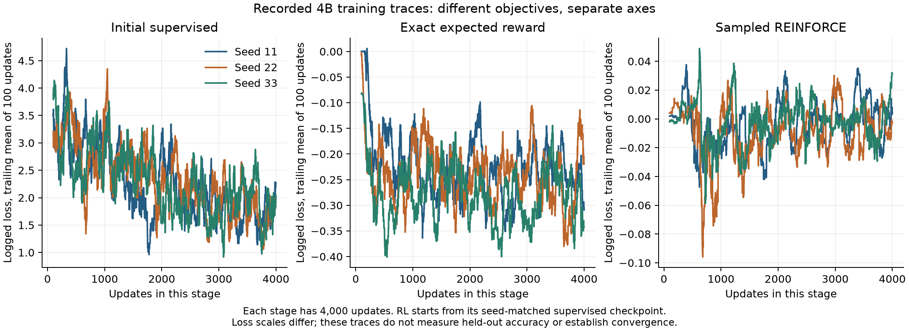
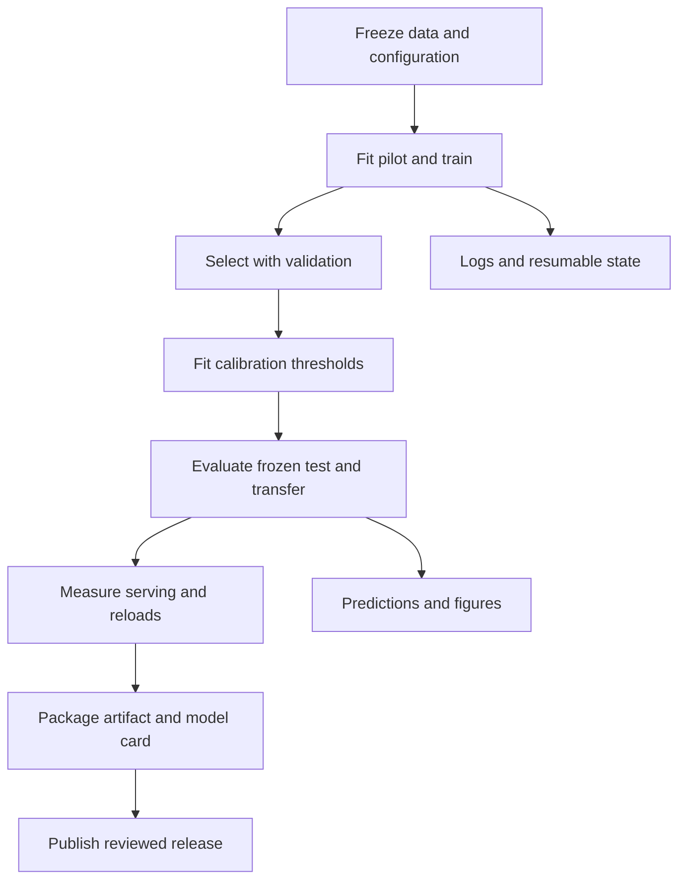
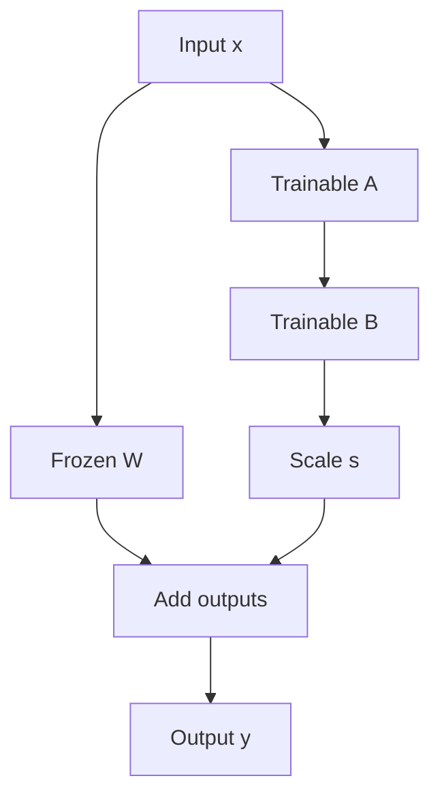
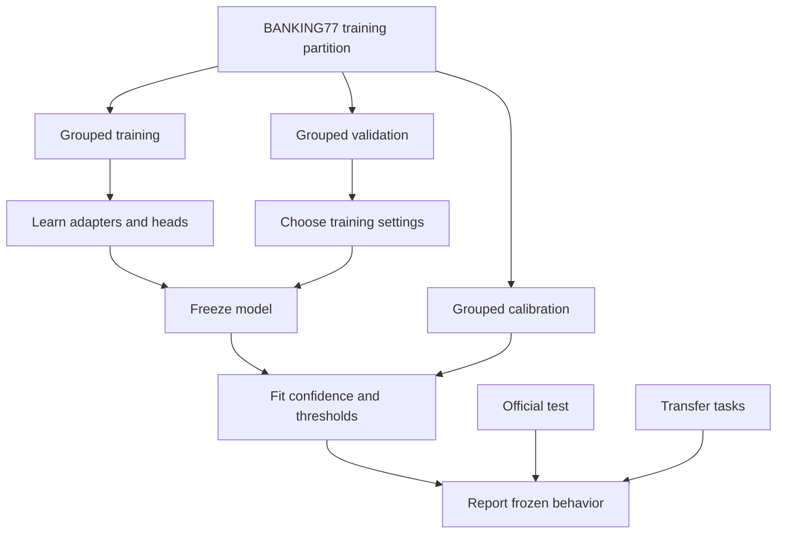
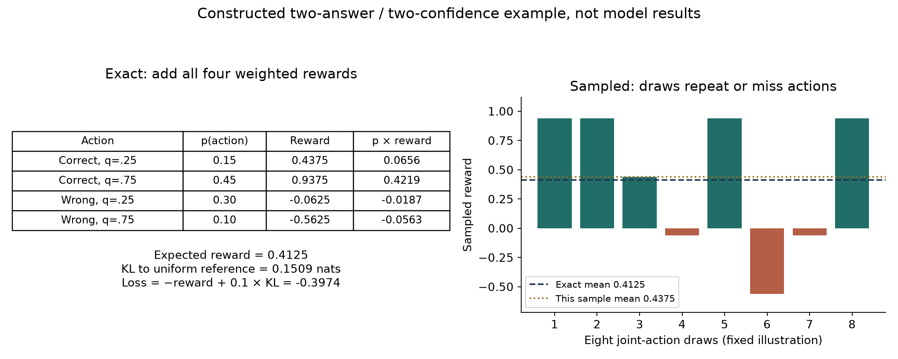

# Train and compare the Qwen models

The published model can already score a request. This guide asks what further training teaches it, then shows how to reproduce the Qwen comparison. Try the [first request and demos](quickstart.md#download-and-score-the-default) before starting a training run. For the forward computation, read [architecture](architecture.md); to build without pretrained weights, use the [scratch guide](scratch.md).

## What fine-tuning adds to an existing model

**Supervised fine-tuning (SFT)** learns from requests with labelled answers. **Reinforcement learning (RL)** uses a reward assigned to the model's answer and confidence. Continued SFT gives the supervised model more training examples; it is our control for whether more training alone explains a gain. The exact and sampled RL methods compute the same reward objective in different ways, explained below.

BANKING77 already supplies the correct banking intent for each training request, so supervised learning is the natural baseline. Those labels also let us compute a reward for every proposed answer: correctness earns reward, while a confidence estimate that disagrees with correctness incurs a penalty. Both methods therefore use the same source of labelled evidence. Each labelled request defines one decision and its possible rewards. The experiment uses neither collected human preferences nor extended environment interactions. [Reinforcement Learning - An Introduction](https://blog.desigeek.com/post/2021/07/reinforcement-learning-an-introduction/) provides background on actions, policies and rewards.

Continued supervision checks the benefit of extra training. Exact RL changes the objective; sampled RL estimates that same objective from fewer actions. Temperature calibration tests an adjustment after training. Together, these controls let us ask which part of the procedure changed the result, rather than treating RL as an automatic upgrade.

A pretrained model can already score candidate tokens in one forward pass. Fine-tuning is not required to create that inference interface, and it is not what removes autoregressive decoding. Our untouched-backbone control measures how well the same prompt and readout work before adaptation.

Training tests whether examples improve discrimination among closely related BANKING77 intents with request-supplied descriptions and aliases. It also trains the newly initialized confidence heads to estimate selected-answer correctness. Those heads require a training signal before their outputs can be interpreted. Randomizing candidate order discourages learning a permanent answer-to-alias mapping, but does not guarantee generalization or order invariance.

The supervised stage establishes the adapted decision model and its confidence estimates. Continued supervision, exact RL and sampled RL then start from that same supervised artifact. This tests whether confidence-aware RL adds value beyond additional supervised exposure. Temperature scaling tests whether simpler post-hoc calibration is sufficient. Untouched-backbone and TF-IDF controls also leave open the possibility that adaptation is unnecessary or a simpler model is preferable.

### Choose LoRA and QLoRA for the available memory

**LoRA**, or low-rank adaptation, represents a weight update using two small trainable matrices. We keep the original backbone weights fixed and train rank-8 LoRA adapters on the attention query, key, value and output projections, alongside the confidence heads. The [worked update](walkthrough.md#3-understand-what-the-optimizer-changes) shows the matrix calculation.

The 0.8B and 4B backbones use **BF16**, a 16-bit floating-point format. The 9B backbone uses **NF4**, a four-bit representation for the stored weights, alongside LoRA. This combination is commonly called **QLoRA** and reduces backbone storage on the available 24 GB GPUs. Configuration files record the precision and adapter settings; four-bit storage does not mean every operation or temporary tensor uses four bits.

This keeps trainable parameter and optimizer-state storage smaller than updating the full backbone, and permits small adapter/head artifacts to share a pinned backbone cache. Backpropagation through the backbone still costs compute; LoRA does not make training free. We have not established that these adapters match or outperform full-parameter fine-tuning, and full-parameter training is not a control in this study.

Changing 9B to NF4 changes precision as well as capacity. The same-size precision control is therefore necessary before attributing differences solely to scale. Fine-tuning on one intent-routing dataset also does not establish a generalist decision model: CLINC transfer, new-task adaptation and forgetting are separate evaluations.

## Choosing model size around the hardware

“Small language model” has no universal parameter cutoff. The 0.8B model is already a small language backbone; 4B is relatively compact, while 9B carries a substantial deployment cost. A decision model describes the scoring interface and behavior, and can use any of these backbones. Calling it a decision model does not remove its transformer computation.

Keeping the Qwen3.5 family across sizes makes capacity easier to study with a shared prompt, readout and training protocol. It does not establish that Qwen is the best production architecture. The 9B precision change remains a confound requiring a same-size control.

The reference machine has three A30s, each with 24 GiB of device memory. We use one GPU per independent run. Those devices do not automatically act as one 72 GiB memory pool. Each configuration must fit its assigned GPU, including weights, activations, adapters, gradients, reference-policy work and runtime allocations.

| Size | Pilot configuration | Observed peak allocated training memory |
|---|---|---:|
| 0.8B | BF16 LoRA | 1.7 GiB |
| 4B | BF16 LoRA | 8.5 GiB |
| 9B | NF4 QLoRA | 12.0 GiB |

The 100-update supervised pilots measured memory on their recorded inputs. Worst-case VRAM and inference requirements need separate measurements. PyTorch allocated peaks also differ from total process memory reported by `nvidia-smi`. Longer inputs, larger batches and different objectives can change memory use. Quantization reduces weight storage but does not guarantee lower latency.

For deployment, select the smallest model that meets measured accepted-case error, coverage, latency and memory requirements. A bounded ModernBERT fixed-taxonomy control provides a smaller-model comparison; a distilled student remains prospective. A fixed-label TF-IDF classifier remains a serious low-cost control for BANKING77; request-supplied unfamiliar candidate descriptions motivate studying a language backbone. See [deployment costs](inference.md#what-the-adapter-saves-and-what-inference-still-costs).

### Keep other backbones as a separate comparison

[Phi-2](https://huggingface.co/microsoft/phi-2) has 2.7B parameters and a 2,048-token context; [Phi-3 Mini](https://huggingface.co/microsoft/Phi-3-mini-4k-instruct) has 3.8B parameters in the linked 4K-context release. Both are language-model alternatives, and both are larger than our 0.8B backbone. They could support direct decision scoring after integration and evaluation, but neither has been tested here. Phi-2's shorter context would change our input limits, so it is not a drop-in replacement for a 4,096-token configuration. A new tokenizer also requires fresh alias verification.

A more distinct comparison would use an encoder such as [DeBERTa-v3-small](https://huggingface.co/microsoft/deberta-v3-small). A fixed-label classification head suits a known taxonomy. Request-defined candidates need a different design, such as scoring context/description pairs or jointly encoding a candidate set. That changes the training interface and computation as candidate count grows; it cannot inherit our token-readout or latency claims unchanged.

The token-alias readout reuses Qwen’s vocabulary head. That keeps the implementation small, but alias choice, order and prompt length can affect the result. A dedicated candidate-scoring head would remove the vocabulary dependency and add another layer to train. We kept the readout fixed for this study to compare objectives and scale within one implementation.

Alternative pretrained backbones, including Phi, are deferred. The study has two complementary tracks: building a small decision network from random initialization and adapting pretrained Qwen. A future backbone comparison could reuse the frozen partitions and tuning controls, but it is not scheduled or required for this release.

The [Unsloth comparison](unsloth.md) tests that dedicated-head alternative using a new answer-only supervised control. It keeps the backbone and exposure matched across readouts; the original four-method schedule below remains a separate experiment.

## Frozen schedule

| Setting | Value |
|---|---|
| Sizes | 0.8B, 4B, 9B |
| Tuning seed | 101, separate from main-comparison seeds |
| Learning rates per method | 0.00003 and 0.0001 |
| Tuning exposure | 1,000 updates per trial |
| Selection data | All 997 validation examples |
| Main seeds | 11, 22, 33 |
| Initial supervised exposure | 4,000 updates |
| Each continuation | 4,000 additional updates |
| Main methods | Supervised, continued supervision, exact RL, sampled RL |
| Final evaluation | All 3,080 test examples and 1,000 reserved calibration examples |

Every method gets the same number of learning-rate trials. The fixed selection rule is highest validation accuracy, then lowest selection negative log-likelihood, then lower learning rate. This prioritizes selection quality; confidence and accepted-case error remain separately reported outcomes.

The selected supervised tuning artifact is shared by all continuation trials. The main comparison then starts fresh at each main seed, with a common supervised artifact for the three continuation methods. Continuations replay the seed-matched data RNG and skip the initial exposure, giving each method identical subsequent examples and candidate order. Initial plus continuation exposure covers approximately one pass through the 7,999 training rows; convergence is not guaranteed.

All hyperparameter decisions are frozen before test/calibration evaluation begins. The validation loader checks its partition filename, hash, and training-group isolation. Each runner also verifies hashes of all data partitions and refuses changes to its frozen plan.

## One optimizer, several training approaches

An optimizer is the rule that adjusts trainable parameters using gradients. These runs all use **AdamW**. A training step, also called an optimizer update, adjusts the LoRA adapters and confidence heads while the backbone weights stay frozen. With accumulation set to one in this schedule, each step consumes one training example.

The four approaches are supervised learning, continued supervision, exact RL, and sampled RL. Exact versus sampled describes how the RL objective and gradient are computed. Both still use AdamW to apply parameter updates. Continued supervision is the control that tests whether extra training alone explains a gain attributed to RL.

## Read the actual training traces



These are trailing 100-update means from the saved 4,000-update stages. Exact RL logs expected-reward loss; REINFORCE logs a baseline-adjusted gradient surrogate. Their numerical levels are not directly comparable, even though their expected gradients target the same objective. The initial supervised loss has another scale. No panel is a validation curve or evidence of convergence. Regenerate with `python scripts/plot_review_evidence.py`; [source hashes and excerpts](../results/review-teaching-v1/manifest.json) connect the chart to the logs.

## Account for 168,000 training steps

The count covers every planned run at all three sizes; it is not the number of optimizers or the training length of a single model.

| Phase | Runs per size | Steps per run | Total steps per size |
|---|---:|---:|---:|
| Tuning: four approaches, two learning rates each | 8 | 1,000 | 8,000 |
| Main comparison: four approaches, three seeds each | 12 | 4,000 | 48,000 |
| Total per size | 20 | Varies | 56,000 |
| All three sizes | 60 | Varies | 168,000 |

Two learning-rate trials give each approach an equal tuning opportunity. Three main seeds expose run-to-run variation. The supervised artifact is trained once per main seed and reused as the starting point for its three continuation branches. Its creation is not counted three times.

The declared budget fixes the work per method. It does not establish an optimal schedule or convergence. Larger tuning grids or more seeds could improve the study at additional cost. The present schedule keeps those costs fixed and visible.

## Reading a training counter

The recorded step counter covers optimizer updates. Validation, calibration and test inference also consume time, so the last training update did not mark the end of the experiment. Keep stage exposure, elapsed time and evaluation status separate when inspecting a run.

The three size studies ran on separate GPUs. Their wall-clock durations overlap; their sum measures accumulated GPU work. Overall elapsed time runs from the first start to the last finish. The local logs and W&B fields retain those distinctions. No whole-project percentage or finish estimate is needed to interpret the results.

## Improvement, epochs and stopping

Each main stage processes 4,000 examples, or about 0.5001 epochs on the 7,999 training rows. The initial supervised model plus one continuation has about 1.0001 epochs of total exposure. Seeds and continuation branches are separate models, so their epochs must not be combined into one model's learning curve.

Training loss is a diagnostic. Compare held-out accuracy/F1, correctness Brier and accepted-case error at fixed coverage to judge improvement. Supervised and RL losses have different meanings. Falling training loss with worsening validation performance suggests overfitting.

Tuning and main evaluations occurred at stage endpoints. They cannot reliably identify a plateau. A future convergence study needs predefined periodic validation, meaningful improvement thresholds and a patience rule; test results must not influence stopping. Numerical failures and resource exhaustion trigger health checks; they provide no evidence of convergence. The healthy runs completed their frozen budgets.

The [W&B guide](tracking.md) explains live epoch counters, individual historical curves, GPU telemetry and retained evidence. The [lessons](learnings.md) describe why hardware, batch size and evaluation work all affect elapsed time.

## Run it

First complete the [installation and BANKING77 preparation](quickstart.md). The configurations share the original pinned backbone cache. Each command below assigns one independent study to one GPU; only run the assignments your machine supports.

```bash
export HF_HOME="$PWD/.cache/huggingface"
export OMP_NUM_THREADS=4
export MYJEV_TRACKING_MODE=disabled
CUDA_VISIBLE_DEVICES=0 .venv/bin/python scripts/run_longer_study.py 0.8b
# In separate terminals on a three-GPU machine:
CUDA_VISIBLE_DEVICES=1 .venv/bin/python scripts/run_longer_study.py 4b
CUDA_VISIBLE_DEVICES=2 .venv/bin/python scripts/run_longer_study.py 9b
```

There are eight tuning runs and twelve main runs per size, plus validation and full evaluation passes. The saved logs record elapsed time separately for each run. The reference setup uses three 24 GB A30s; it does not rent cloud hardware.

## Check progress and resume

```bash
.venv/bin/python scripts/monitor_longer_study.py --once
.venv/bin/python scripts/monitor_longer_study.py --interval 60
```

The three-size monitor reports each stage, current training step, completed validation trials, and full evaluations. With only one size launched, the other sizes remain marked as starting; use `--once` for a snapshot instead of waiting for all three.

Per-size logs and state live under `results/longer-v1/`; adapters and resumable state live under `artifacts/longer-v1/`. Restart the same runner command to resume. A per-size process lock prevents duplicate runners. Completed stages are skipped; interrupted updates after the most recent checkpoint are preserved separately before replay. A new stage refuses to start below 8 GiB free disk. Do not change the plan in place after starting a study.

## What this batch does not cover

This batch focuses on the four main methods; correctness-only/Brier ablations were not repeated at longer exposure. Replicated precision controls, broader transfer, exploratory machine-reference archive adaptation and final release selection were completed in separate follow-ups. Keep their actual seeds, data exposure, precision and evaluation scope distinct; see the [roadmap](roadmap.md).

## Save inference files and resumable training state

| File or directory | Role | Required for inference? |
|---|---|---|
| `artifact/manifest.json` | Pinned revisions, aliases, precision, head semantics and checksums | Yes |
| `artifact/adapter/` | Qwen LoRA parameters | Yes for adapted Qwen |
| `artifact/heads.safetensors` | Selection/correctness head parameters | Yes |
| `resume.pt` | Trainable weights, optimizer state, data cursor/order and RNG state | No; trusted local training recovery only |
| `training.jsonl` | Per-update loss, exposure, time and allocated GPU memory | Evidence, not model parameters |
| Shared Hugging Face cache | Full pinned backbone and tokenizer | Yes for Qwen; adapters do not replace it |
| Scratch artifact | Its complete small network, byte-tokenizer specification and manifest | Yes for scratch; no pretrained backbone |

Training retention stores selected deployable artifacts and resumable state. It does not promise that every historical update has a permanently saved checkpoint. The scratch teaching runner currently saves completed stage artifacts and does not resume partially completed optimizer state.



The arrows describe dependency order. Freeze tuning decisions before observing test performance. A new exploratory recipe needs its own declared protocol and honest disclosure of previously inspected tests.

## Follow the training branches and data roles





These diagrams separate trainable updates from the deployed backbone and distinguish training, validation, calibration and test decisions. See the [diagram provenance](../results/teaching-diagrams-v1/manifest.json) and `scripts/draw_decision_diagrams.py`.

## Work through one update

The [hands-on route](walkthrough.md#3-understand-what-the-optimizer-changes) derives a cross-entropy gradient, the LoRA matrix shapes and four confidence rewards. Run `python scripts/training_mechanics_demo.py` on CPU to inspect actual numbers before launching a GPU study. [Objective tests](../tests/test_objectives.py) check the exact and sampled mathematics.



This original arithmetic illustration is not a trained-model result or a Monte Carlo gradient validation. Its [source numbers](../results/training-eval-diagrams-v1/summary.json) and `scripts/draw_training_eval_lessons.py` make the calculation reproducible.

## Defaults retained with the training evidence

The historical runs used AdamW’s default weight decay of 0.01 and eight REINFORCE samples per example. The runner serializes these values explicitly as `weight_decay` and `reinforce_samples`, along with the initialization artifact revision. This metadata clarification does not rewrite prior manifests or change historical results. The NF4 setup prepares the backbone once before attaching trainable adapters.

## Interpreting the selected learning rates

The validation-selected learning rate was `1e-4` for initial and continued supervision, and `3e-5` for exact and sampled RL, at all three sizes. A learning rate scales the optimizer's parameter update; it is not a confidence threshold. Each method receives the same number of validation trials and can select a rate suited to its gradient scale. Every main artifact manifest records the selected value.
