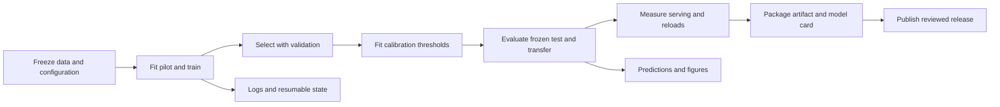

# Longer matched training comparison

**Status: complete.** All 24 tuning runs and 36 main evaluations finished. See the [descriptive results](../results/longer-v1/summary.md); paired inference and broader release gates remain pending. The initial feasibility study remains available in [the results guide](experiments.md). This next comparison uses longer exposure, validation-only learning-rate selection, and the complete official BANKING77 test set.

## Why fine-tune an already pretrained model?

A pretrained model can already score candidate tokens in one forward pass. Fine-tuning is not required to create that inference interface, and it is not what removes autoregressive decoding. Our untouched-backbone control measures how well the same prompt and readout work before adaptation.

We train to test two additional capabilities. First, can supervised examples improve discrimination among closely related BANKING77 intents when candidate descriptions and their token aliases appear in the request? Second, can the custom confidence heads learn useful estimates of selected-answer correctness? Those heads are newly initialized; simply attaching them to a pretrained backbone does not produce meaningful confidence. Randomizing candidate order discourages learning a permanent answer-to-alias mapping, but does not guarantee generalization or order invariance.

The supervised stage establishes the adapted decision model and its confidence estimates. Continued supervision, exact RL and sampled RL then start from that same supervised artifact. This tests whether confidence-aware RL adds value beyond additional supervised exposure. Temperature scaling tests whether simpler post-hoc calibration is sufficient. Untouched-backbone and TF-IDF controls also leave open the possibility that adaptation is unnecessary or a simpler model is preferable.

### Why LoRA and QLoRA?

We freeze the pretrained backbone weights and train rank-8 LoRA adapters on the attention query, key, value and output projections, alongside the custom confidence heads. BF16 LoRA is used at 0.8B and 4B. The 9B backbone uses four-bit NF4 with LoRA, commonly called QLoRA, to reduce backbone storage on the available 24 GB GPUs. Configuration files record the exact precision and adapter setup.

This keeps trainable parameter and optimizer-state storage smaller than updating the full backbone, and permits small adapter/head artifacts to share a pinned backbone cache. Backpropagation through the backbone still costs compute; LoRA does not make training free. We have not established that these adapters match or outperform full-parameter fine-tuning, and full-parameter training is not a control in this study.

Changing 9B to NF4 changes precision as well as capacity. The same-size precision control is therefore necessary before attributing differences solely to scale. Fine-tuning on one intent-routing dataset also does not establish a generalist decision model: CLINC transfer, new-task adaptation and forgetting are separate evaluations.

## Choosing model size around the hardware

“Small language model” has no universal parameter cutoff. The 0.8B model is already a small language backbone; 4B is relatively compact, while 9B carries a substantial deployment cost. A decision model describes the scoring interface and behavior, and can use any of these backbones. Calling it a decision model does not remove its transformer computation.

Keeping the Qwen3.5 family across sizes makes capacity easier to study with a shared prompt, readout and training protocol. It does not establish that Qwen is the best production architecture. The 9B precision change remains a confound requiring a same-size control.

The reference machine has three A30s, each with 24 GiB of device memory. We use one GPU per independent run. Those devices do not automatically act as one 72 GiB memory pool. Each configuration must fit its assigned GPU, including weights, activations, adapters, gradients, reference-policy work and runtime allocations.

| Size | Pilot configuration | Observed peak allocated training memory |
|---|---|---:|
| 0.8B | BF16 LoRA | 1.7 GiB |
| 4B | BF16 LoRA | 8.5 GiB |
| 9B | NF4 QLoRA | 12.0 GiB |

These are 100-update supervised pilot measurements for the tested inputs, not worst-case VRAM reservations or inference requirements. PyTorch allocated peaks also differ from total process memory reported by `nvidia-smi`. Longer inputs, larger batches and different objectives can change memory use. Quantization reduces weight storage but does not guarantee lower latency.

For deployment, select the smallest model that meets measured accepted-case error, coverage, latency and memory requirements. A smaller encoder or distilled student is a follow-up experiment, not a completed comparison. A fixed-label TF-IDF classifier remains a serious low-cost control for BANKING77; request-supplied unfamiliar candidate descriptions motivate studying a language backbone. See [deployment costs](inference.md#what-the-adapter-saves-and-what-inference-still-costs).

### Would an older Microsoft model be a better fit?

[Phi-2](https://huggingface.co/microsoft/phi-2) has 2.7B parameters and a 2,048-token context; [Phi-3 Mini](https://huggingface.co/microsoft/Phi-3-mini-4k-instruct) has 3.8B parameters in the linked 4K-context release. Both are language-model alternatives, and both are larger than our 0.8B backbone. They could support direct decision scoring after integration and evaluation, but neither has been tested here. Phi-2's shorter context would change our input limits, so it is not a drop-in replacement for a 4,096-token configuration. A new tokenizer also requires fresh alias verification.

A more distinct comparison would use an encoder such as [DeBERTa-v3-small](https://huggingface.co/microsoft/deberta-v3-small). A fixed-label classification head suits a known taxonomy. Request-defined candidates need a different design, such as scoring context/description pairs or jointly encoding a candidate set. That changes the training interface and computation as candidate count grows; it cannot inherit our token-readout or latency claims unchanged.

Using pretrained representations is a defensible transfer-learning choice. The token-alias readout is a pragmatic reuse of the vocabulary head, with real limitations: alias choice, order sensitivity and prompt length need testing. A candidate-conditioned scoring head can remove the dependence on vocabulary aliases, but must be trained and evaluated. The present study tests objectives and scale within one implementation; it does not establish that this is the smallest or fastest architecture for the task.

Alternative pretrained backbones, including Phi, are deferred. The active study now has two complementary tracks: building a small decision network from random initialization and adapting pretrained Qwen. A future backbone comparison could reuse the frozen partitions and tuning controls, but it is not scheduled or required for this release.

## Frozen schedule

| Setting | Value |
|---|---|
| Sizes | 0.8B, 4B, 9B |
| Tuning seed | 101, separate from main-comparison seeds |
| Learning rates per method | 0.00003 and 0.0001 |
| Tuning exposure | 1,000 updates per trial |
| Selection data | All 997 validation examples |
| Main seeds | 11, 22, 33 |
| Initial supervised exposure | 4,000 updates |
| Each continuation | 4,000 additional updates |
| Main methods | Supervised, continued supervision, exact RL, sampled RL |
| Final evaluation | All 3,080 test examples and 1,000 reserved calibration examples |

Every method gets the same number of learning-rate trials. The fixed selection rule is highest validation accuracy, then lowest selection negative log-likelihood, then lower learning rate. This prioritizes selection quality; confidence and accepted-case error remain separately reported outcomes.

The selected supervised tuning artifact is shared by all continuation trials. The main comparison then starts fresh at each main seed, with a common supervised artifact for the three continuation methods. Continuations replay the seed-matched data RNG and skip the initial exposure, giving each method identical subsequent examples and candidate order. Initial plus continuation exposure covers approximately one pass through the 7,999 training rows; convergence is not guaranteed.

All hyperparameter decisions are frozen before test/calibration evaluation begins. The validation loader checks its partition filename, hash, and training-group isolation. Each runner also verifies hashes of all data partitions and refuses changes to its frozen plan.

## One optimizer, several training approaches

An optimizer is the rule that adjusts trainable parameters using gradients. These runs all use **AdamW**. A training step, also called an optimizer update, adjusts the LoRA adapters and confidence heads while the backbone weights stay frozen. With accumulation set to one in this schedule, each step consumes one training example.

The four approaches are supervised learning, continued supervision, exact RL, and sampled RL. Exact versus sampled describes how the RL objective and gradient are computed. Both still use AdamW to apply parameter updates. Continued supervision is the control that tests whether extra training alone explains a gain attributed to RL.

## Why 168,000 training steps?

The count covers every planned run at all three sizes; it is not the number of optimizers or the training length of a single model.

| Phase | Runs per size | Steps per run | Total steps per size |
|---|---:|---:|---:|
| Tuning: four approaches, two learning rates each | 8 | 1,000 | 8,000 |
| Main comparison: four approaches, three seeds each | 12 | 4,000 | 48,000 |
| Total per size | 20 | Varies | 56,000 |
| All three sizes | 60 | Varies | 168,000 |

Two learning-rate trials give each approach an equal tuning opportunity. Three main seeds expose run-to-run variation. The supervised artifact is trained once per main seed and reused as the starting point for its three continuation branches. Its creation is not counted three times.

This budget is a declared experimental choice, not evidence that this amount of training is optimal or sufficient for convergence. Larger tuning grids or more seeds could improve the study at additional cost. The present schedule keeps those costs fixed and visible.

## What progress and completion time mean

The exact training percentage is completed optimizer steps divided by 168,000. It excludes validation, test evaluation, and post-hoc calibration work. A training counter reaching its end therefore does not mean the entire batch is finished.

An approximate batch percentage can weight the remaining training and evaluation tasks by measured time. We use observed update and inference speeds where available. Until an RL timing is observed, the estimate assumes an RL update takes 1.3 times the supervised update time. A broad allowance around that estimate accounts for uncertainty; it is a planning range, not a statistical confidence interval. Estimates can change as more tasks finish.

The three GPUs run independently. The overall finish estimate is the longest remaining per-GPU duration, not the sum of all three durations. A failed or stopped job makes its completion estimate unavailable until the problem is resolved.

Batch completion means its scheduled training, validation selection, full-test evaluations, and calibration controls are finished. Analysis, broader transfer studies, archive adaptation, artifact releases, and blog publication remain separate project work. The [roadmap](roadmap.md) keeps those boundaries explicit; there is no invented whole-project completion percentage.

## Improvement, epochs and stopping

Each main stage processes 4,000 examples, or about 0.5001 epochs on the 7,999 training rows. The initial supervised model plus one continuation has about 1.0001 epochs of total exposure. Seeds and continuation branches are separate models, so their epochs must not be combined into one model's learning curve.

Training loss is a diagnostic. Compare held-out accuracy/F1, correctness Brier and accepted-case error at fixed coverage to judge improvement. Supervised and RL losses have different meanings. Falling training loss with worsening validation performance suggests overfitting.

Current tuning and main evaluations occur at stage endpoints. They cannot reliably identify a plateau. A future convergence study needs predefined periodic validation, meaningful improvement thresholds and a patience rule; test results must not influence stopping. Numerical failures and resource exhaustion are health conditions, not convergence evidence. Healthy runs in this batch finish their frozen budgets.

The [W&B guide](tracking.md) explains live epoch counters, individual historical curves, GPU telemetry and retained evidence. The [lessons](learnings.md) describe why hardware, batch size and evaluation work all affect elapsed time.

## Run it

First complete the [installation and BANKING77 preparation](quickstart.md). The configurations share the original pinned backbone cache. Each command below assigns one independent study to one GPU; only run the assignments your machine supports.

```bash
export HF_HOME="$PWD/.cache/huggingface"
export OMP_NUM_THREADS=4
export MYJEV_TRACKING_MODE=disabled
CUDA_VISIBLE_DEVICES=0 .venv/bin/python scripts/run_longer_study.py 0.8b
# In separate terminals on a three-GPU machine:
CUDA_VISIBLE_DEVICES=1 .venv/bin/python scripts/run_longer_study.py 4b
CUDA_VISIBLE_DEVICES=2 .venv/bin/python scripts/run_longer_study.py 9b
```

There are eight tuning runs and twelve main runs per size, plus validation and full evaluation passes. This is a substantial local workload expected to take many hours. The reference setup uses three 24 GB A30s; it does not rent cloud hardware.

## Check progress and resume

```bash
.venv/bin/python scripts/monitor_longer_study.py --once
.venv/bin/python scripts/monitor_longer_study.py --interval 60
```

The three-size monitor reports each stage, current training step, completed validation trials, and full evaluations. With only one size launched, the other sizes remain marked as starting; use `--once` for a snapshot instead of waiting for all three.

Per-size logs and state live under `results/longer-v1/`; adapters and resumable state live under `artifacts/longer-v1/`. Restart the same runner command to resume. A per-size process lock prevents duplicate runners. Completed stages are skipped; interrupted updates after the most recent checkpoint are preserved separately before replay. A new stage refuses to start below 8 GiB free disk. Do not change the plan in place after starting a study.

## What this batch does not cover

This batch focuses on the four main methods. It does not complete the remaining correctness-only/Brier ablations at longer exposure, replicated precision controls, broad transfer, archive adaptation, or final release selection. Those remain on the [roadmap](roadmap.md). New results should be reported with the actual completed seeds, data exposure, precision, and evaluation scope.

## Which files serve a model, and which resume training?

| File or directory | Role | Required for inference? |
|---|---|---|
| `artifact/manifest.json` | Pinned revisions, aliases, precision, head semantics and checksums | Yes |
| `artifact/adapter/` | Qwen LoRA parameters | Yes for adapted Qwen |
| `artifact/heads.safetensors` | Selection/correctness head parameters | Yes |
| `resume.pt` | Trainable weights, optimizer state, data cursor/order and RNG state | No; trusted local training recovery only |
| `training.jsonl` | Per-update loss, exposure, time and allocated GPU memory | Evidence, not model parameters |
| Shared Hugging Face cache | Full pinned backbone and tokenizer | Yes for Qwen; adapters do not replace it |
| Scratch artifact | Its complete small network, byte-tokenizer specification and manifest | Yes for scratch; no pretrained backbone |

Training retention stores selected deployable artifacts and resumable state. It does not promise that every historical update has a permanently saved checkpoint. The scratch teaching runner currently saves completed stage artifacts and does not resume partially completed optimizer state.



The arrows describe a dependency order, not permission to tune again after observing test performance. A new exploratory recipe needs its own declared protocol and honest disclosure of previously inspected tests.
