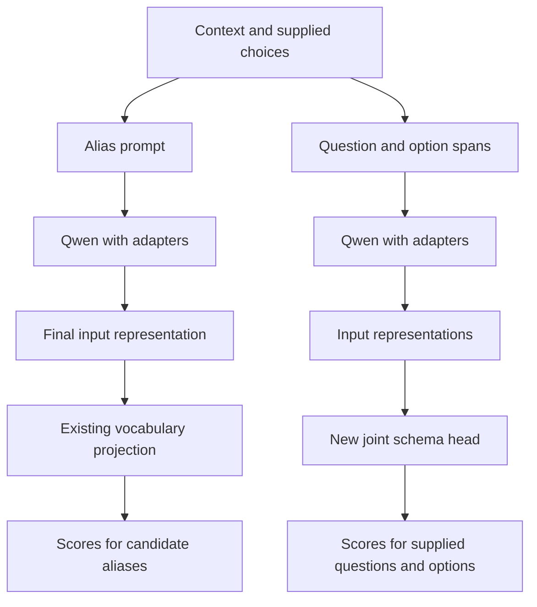

# Compare two ways to read a decision from Qwen

A language model does not have to generate an answer to be useful. Our released models read scores for candidate aliases from Qwen's vocabulary output. Unsloth offers another route: attach a trainable decision head that reads the input representations and scores the supplied questions and choices. Both approaches reuse a pretrained language backbone. The difference is how they turn its representations into an answer.

This guide describes the separate 0.8B comparison implemented in `scripts/run_head_comparison.py`. It does not change the six downloadable myJEV models or their serving requirements. Start with the [quick start](quickstart.md) if you want to use those releases.

## What the new head does

In the alias approach, a request assigns a short token such as `A` to each candidate description. We read that token's score at the final input position. The output projection already exists in Qwen, so we can use the pretrained model before task training. We must verify that each alias is a single token and test sensitivity to its position.

A **joint schema head** reads representations of the context, questions and option descriptions. The schema is the set of questions and allowed answers in the request. Clef's head includes layers that gather evidence from those representations and layers that score the choices. Several questions can share one backbone pass. Attaching this head adds parameters that need training; it does not create another pretrained model from random weights.

The pinned Unsloth conversion gives this 0.8B backbone a width-512 head with two routing layers and four decoder layers. Our load check counted 27,324,932 head parameters. Both arms train the same 540,672 attention-adapter parameters. The head therefore changes both the computation and the number of parameters we optimize. Removing candidate-token aliases does not by itself establish a speed improvement.



| Question | Released myJEV approach | Optional Clef comparison |
|---|---|---|
| Where do answer scores come from? | Selected vocabulary rows at the final input position | A new head over context, question and option representations |
| What is the pretrained component? | Qwen backbone and vocabulary projection | The same Qwen backbone and vocabulary representations used by the head |
| How many questions does the tested interface accept? | One candidate-selection question per request | Several typed questions can share the backbone computation |
| What needs additional training? | Adapters and the released model's confidence heads | Adapters and the new joint schema head |
| Is the confidence meaning identical? | Depends on the release's selected-score or learned-correctness mode | This comparison uses the selected option probability, with a separate temperature fit |

A shared pass is a computation property. It does not establish that the model can answer unfamiliar questions correctly. Our qualitative multi-question probe asks about routing, a refund request and urgency; BANKING-only training cannot establish general performance on all three.

## Why this is a new matched experiment

[Unsloth's tutorial](https://unsloth.ai/docs/basics/train-your-own-decision-model-with-unsloth) uses a broader training mixture, including BANKING77 and CLINC150. Our original study reserves CLINC150 for transfer evaluation. Comparing its headline accuracy with our transfer numbers would compare different tasks and training exposure.

We keep the BANKING partitions, backbone revision, BF16 precision, rank-8 attention adapters, candidate order and example exposure fixed. Both arms use Unsloth in an isolated environment, BF16 autocast for the forward computation, and answer cross-entropy. Adapter and head parameters are stored in FP32; the raw scores are converted to FP32 before the loss. These numerical settings belong to this comparison rather than the earlier reference-runtime releases. Neither uses the original scalar-confidence loss or the 21-bin confidence policy. Both receive identical post-hoc temperature fitting on calibration data. This gives the new head a fairer control than comparing it directly with a historical release trained under different settings.

The prompts still differ: one teaches Qwen an alias mapping, while the other exposes question and option spans to Clef. Interpret this as a comparison of the two prompt/readout systems. It does not isolate the head alone.

| Setting | Both arms |
|---|---|
| Backbone | Pinned Qwen3.5-0.8B |
| Feasibility pilot | 100 updates on seed 101 |
| Learning-rate trials | 250 updates each at 0.00003 and 0.0001 |
| Selection rule | Validation accuracy, then selection NLL, then lower learning rate |
| Main seeds | 11, 22 and 33 |
| Main exposure | 1,000 updates × 8 examples = 8,000 examples per run |
| Calibration | Same positive scalar temperature; calibration partition only |
| Final test | All 3,080 official BANKING77 test examples |

The [configuration](../configs/head-comparison-v1.json) records hashes and all settings. Upstream Clef sorts option identifiers. Our wrapper supplies neutral identifiers such as `c0000`, preserving the assigned description order without revealing the original intent names. Per-request permutation tests keep temperature and acceptance thresholds fixed.

## What the local pilot measured

Both 100-update pilots completed and fit comfortably on one A30. Peak allocated memory was 2.24 GiB for aliases and 3.01 GiB for Clef. The same requests averaged 876 alias-prompt tokens and 1,908 Clef-prompt tokens, so differences in work reflect the prompt as well as the head. The [saved report](../results/unsloth-head-v1/report.md) distinguishes these feasibility checks from final quality measurements.

## Build your own decision head

The [candidate-head walkthrough](candidate-head.md) implements a smaller original design: one four-head attention layer and a shared scorer on frozen Qwen representations. It explains token spans, masks, the 216,193 trainable parameters and the head-only training procedure. That one-seed experiment is separate from this matched alias/Clef study. Both retain their own settings and results.

## Reproduce in a separate environment

Use Python 3.12 and a compatible NVIDIA GPU. The measured setup is an A30 with 24 GB of VRAM. Leave the inference environment intact:

```bash
python3.12 -m venv .venv-unsloth
.venv-unsloth/bin/pip install -r requirements.unsloth.lock
.venv-unsloth/bin/pip install --no-deps -e .
```

Prepare the frozen BANKING data using the [training guide](training.md). The runner verifies every partition hash before accepting it. Run a pilot for each arm, assigning a different GPU if available:

```bash
CUDA_VISIBLE_DEVICES=0 .venv-unsloth/bin/python scripts/run_head_comparison.py train \
  --arm alias --seed 101 --updates 100 --learning-rate .0001 \
  --artifact artifacts/head-comparison-v1/pilot/alias \
  --output results/unsloth-head-v1/pilot/alias

CUDA_VISIBLE_DEVICES=1 .venv-unsloth/bin/python scripts/run_head_comparison.py train \
  --arm clef --seed 101 --updates 100 --learning-rate .0001 \
  --artifact artifacts/head-comparison-v1/pilot/clef \
  --output results/unsloth-head-v1/pilot/clef
```

On a one-GPU host, run them sequentially with `CUDA_VISIBLE_DEVICES=0`. The orchestration script expects three visible physical GPUs for the main seeds; individual runner commands support one-GPU execution. It will refuse tuning until both pilots finish and their initial adapter hashes agree.

```bash
.venv-unsloth/bin/python scripts/orchestrate_head_comparison.py tune
# Inspect results/unsloth-head-v1/selection.json before running the main study.
.venv-unsloth/bin/python scripts/orchestrate_head_comparison.py main
```

The first loading attempt required `bitsandbytes`, even though quantization was disabled. The lock includes it. The first compiled Clef backward pass then failed with a tensor-stride assertion. The experiment configuration disables Torch and Unsloth compilation for both arms. Both arms also use the reference PyTorch causal convolution rather than the optional optimized extension. The measurements apply to eager execution. The fastest available Unsloth settings remain unbenchmarked here. The [environment record](../results/unsloth-head-v1/environment.json) identifies dependencies, hardware and the public source checkpoint.

Every run saves training JSONL, configuration, data/order hashes, parameter counts and memory measurements. The local checkpoint contains adapters and, for Clef, the head; it still needs the pinned backbone. These research checkpoints use this script's loader and are not accepted by the released `myjev score` CLI.

## Attribution and scope

The implementation imports the optional dependency rather than vendoring its code. The [pinned conversion](https://github.com/unslothai/unsloth/blob/cc9128134156cc51f94eeb76d3d19f80bddbc8a7/unsloth/models/decision_from_lm.py) and [head implementation](https://github.com/unslothai/unsloth/blob/cc9128134156cc51f94eeb76d3d19f80bddbc8a7/unsloth/models/clef.py) carry AGPL-3.0-only notices; the latter attributes its vendored reference implementation to Cloudflare under Apache-2.0. myJEV's MIT license does not replace dependency licenses.

The original supervision/RL comparison answers how objectives and capacity changed results within one readout. This experiment asks whether changing the readout changes the result. Neither experiment establishes TypeSafe Jev's undisclosed architecture or reproduces a vendor's hosted latency.
