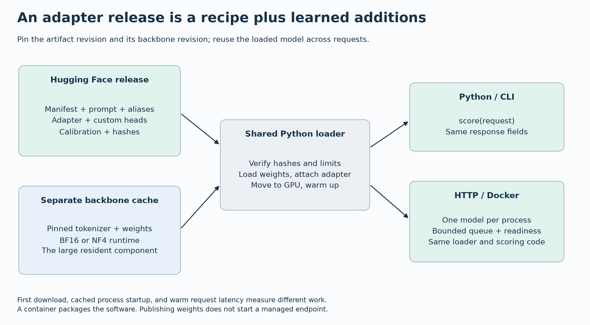

# A hands-on route through myJEV

Start with the output, then inspect the arithmetic and trainable components, then decide what evidence would justify using the model. This follows the practical learning sequence of [helloLondon](https://github.com/bahree/helloLondon), adapted to classification and confidence rather than generated text.

## 1. Install once, choose the amount of compute

Use Python 3.12 on Linux and the [locked installation](quickstart.md#install-and-test). Reading the reports requires no installation. The arithmetic and calibration labs run on CPU without downloaded model weights. Released Qwen scoring was tested on 24 GB A30 GPUs; its first load downloads a separately pinned backbone. The adapter is only the learned update, not the complete inference model.

| Route | First executable step | What you learn |
|---|---|---|
| CPU arithmetic | `.venv/bin/python scripts/training_mechanics_demo.py` | A supervised update, a low-rank update and confidence reward |
| CPU confidence lab | `.venv/bin/python scripts/calibration_lab.py --output results/my-calibration-lab` | Matched losses, held-out calibration and known probabilities |
| Published model | `.venv/bin/python scripts/run_demos.py` | Actual decisions and failure cases with no training |
| Build from scratch | [Scratch commands](scratch.md) | Byte tokens, encoder features, candidate scoring and failure diagnosis |
| Train adapters | [Training commands](training.md#run-it) | Fixed backbone, LoRA parameters and matched continuation branches |
| Run a service | [Inference and Docker](inference.md) | The same decision exposed through Python, CLI and HTTP |

Use a new output folder for the calibration lab. It refuses to overwrite existing evidence. Its [recorded report](../results/calibration-lab-v1/report.md) and [executed source](../results/calibration-lab-v1/executed-script.py) preserve the original experiment.

## 2. Follow one decision

The billing demonstration produces this abbreviated response from the released 4B model:

```json
{
  "selected_id": "billing",
  "selection_scores": {
    "billing": 0.9834240078926086,
    "technical": 0.005727097392082214,
    "other": 0.01084891613572836
  },
  "confidence": 0.9834240078926086,
  "confidence_mode": "selection"
}
```

The [complete saved response](../results/demos-v1/4b-responses.jsonl) also records artifact and calibration identities. Here confidence equals the selected temperature-scaled selection score because this release uses that calibration method. Other artifacts use the separate scalar or confidence-policy head. Equal numbers in this example do not make these concepts interchangeable.

For candidate logits `z` and positive temperature `T`, selection probabilities are `softmax(z/T)`. The largest value selects a candidate. Changing a positive scalar temperature preserves the winner but changes probability sharpness. The RL artifact instead has a conditional distribution over 21 confidence actions for each candidate, and reports the selected candidate's expected confidence.


See [architecture](architecture.md) for the implemented network and [contract tests](../tests/test_contract.py) for the observable behavior. The original seven demos include an honest failure: the 0.8B model approves a day-14 refund with confidence 0.9892 when the rule requires fewer than 14 days. A confident answer can be wrong even in a small, clear example.

## 3. Understand what the optimizer changes

With a correct class at index 1 and logits `[0, 0, 0]`, cross-entropy starts at `log(3)`. Its logit gradient is `[1/3, -2/3, 1/3]`. A gradient-descent step of size 0.3 moves the logits to `[-0.1, 0.2, -0.1]`: the correct answer becomes more probable. The arithmetic lab prints the actual values.

LoRA represents a weight update as `B @ A`. With `W` shaped `[d_out, d_in]`, `A` shaped `[r, d_in]` and `B` shaped `[d_out, r]`, the layer computes `W @ x + B @ (A @ x)` apart from the configured scaling. Freezing `W` reduces trainable state, but that multiplication still runs. The [training guide](training.md) explains BF16 versus NF4 and why the three GPUs run independent models.

For correctness `c` and confidence `q`, reward is `c - (q-c)^2`. A correct answer at 0.9 receives 0.99; an incorrect answer at 0.9 receives -0.81. Exact optimization sums reward over every candidate/confidence action. Sampled REINFORCE estimates the same objective using eight samples with a leave-one-out baseline. The frozen supervised reference supplies KL regularization. [Objective tests](../tests/test_objectives.py) check arithmetic and gradients. A proper-scoring reward component does not establish calibration of the full joint objective.

## 4. Decide whether it improved

Use training data for gradients, validation for permitted configuration selection, calibration for temperature or escalation thresholds, and test data once for the frozen comparison. Training loss alone does not establish useful generalization. Seed variation and shared examples matter when comparing methods.

Suppose a fixed threshold accepts 80 of 100 requests and four accepted decisions are wrong. Coverage is 80%, and accepted-case error is 4/80 = 5%, not 4/100. Those counts still need uncertainty and the threshold must have been chosen on calibration data. A perfect reviewer for the other 20 is a simulation unless reviewer performance was measured.

The [decision lessons](decision-lessons.md) work through these quantities, costs, base-rate confidence and known uncertainty. The [experiments](experiments.md) separate the short pilot, full Qwen comparison and later bounded controls. ModernBERT and TF-IDF are operational alternatives for fixed labels; their interfaces and training budgets differ from request-supplied candidate descriptions.

## 5. Package what the reader actually needs

Load the manifest-pinned backbone, tokenizer, adapter, confidence head and calibration together. A resumable training state additionally contains optimizer and random-number state; it is not required for inference. The [model cards](../model_cards/README.md) explain each released variant.



The local `myjev:0.1.1-hub` image passed direct Hub loading and exact host/container response comparison. [Hosting](hosting.md) separates this measured local path from the unexecuted managed endpoint recipe. No public registry or always-on service is implied by a Hub weights release.
