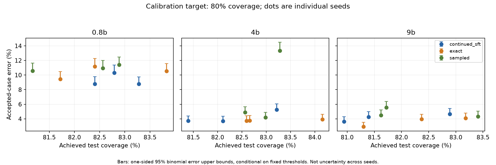

# Operational confidence after longer training

Full official BANKING77 test, thresholds fixed using each run calibration data. Individual seeds shown; no pooling of repeated test examples as independent observations.

error_upper_95 is the one-sided 95% Clopper-Pearson bound conditional on a fixed threshold, under independent Bernoulli sampling. error_cluster_ci95 is the existing group bootstrap interval. Neither accounts for repeated comparison selection or a new deployment distribution.

Zero observed errors or a degenerate bootstrap interval do not establish zero risk. A calibration empirical-error target is not a test guarantee.

Each cell below spans the three observed seeds. Coverage is the fraction accepted, error is among accepted examples, and the upper bound is a per-seed bound, not an interval for a pooled three-seed estimator. Threshold targets were set on calibration only.

| Size | Method/confidence | Calibration target | Test coverage range | Accepted-error range | One-sided upper bound range |
|---|---|---|---:|---:|---:|
| 0.8b | continued_sft/temperature | coverage_0.8 | 82.40-83.28% | 8.77-10.31% | 9.75-11.36% |
| 0.8b | continued_sft/temperature | empirical_error_0.01 | 4.42-9.12% | 0.00-4.98% | 2.18-7.68% |
| 0.8b | continued_sft/temperature | empirical_error_0.05 | 55.26-68.21% | 3.76-5.42% | 4.61-6.34% |
| 0.8b | exact/policy | coverage_0.8 | 81.72-83.83% | 9.46-11.19% | 10.47-12.27% |
| 0.8b | exact/policy | empirical_error_0.01 | 2.53-28.31% | 1.28-1.72% | 2.50-5.94% |
| 0.8b | exact/policy | empirical_error_0.05 | 63.25-66.04% | 5.27-6.59% | 6.17-7.56% |
| 0.8b | sampled/policy | coverage_0.8 | 81.17-82.89% | 10.56-11.40% | 11.63-12.49% |
| 0.8b | sampled/policy | empirical_error_0.01 | 0.00-2.53% | 0.00-8.89% | 3.77-19.20% |
| 0.8b | sampled/policy | empirical_error_0.05 | 1.46-63.96% | 4.20-8.89% | 5.23-19.20% |
| 4b | continued_sft/temperature | coverage_0.8 | 81.40-83.21% | 3.68-5.27% | 4.35-6.05% |
| 4b | continued_sft/temperature | empirical_error_0.01 | 18.47-47.21% | 0.96-1.41% | 1.50-2.52% |
| 4b | continued_sft/temperature | empirical_error_0.05 | 79.09-84.74% | 3.33-5.36% | 3.99-6.15% |
| 4b | exact/policy | coverage_0.8 | 82.60-84.16% | 3.73-3.94% | 4.41-4.62% |
| 4b | exact/policy | empirical_error_0.01 | 16.75-34.42% | 0.39-1.32% | 1.22-2.06% |
| 4b | exact/policy | empirical_error_0.05 | 85.06-88.57% | 3.82-4.99% | 4.49-5.73% |
| 4b | sampled/policy | coverage_0.8 | 82.56-83.28% | 4.19-13.33% | 4.90-14.49% |
| 4b | sampled/policy | empirical_error_0.01 | 2.56-31.82% | 0.92-3.80% | 1.60-9.52% |
| 4b | sampled/policy | empirical_error_0.05 | 8.15-81.85% | 3.97-6.37% | 4.67-9.52% |
| 9b | continued_sft/temperature | coverage_0.8 | 80.94-82.89% | 3.61-4.66% | 4.29-5.41% |
| 9b | continued_sft/temperature | empirical_error_0.01 | 31.88-47.76% | 0.51-1.32% | 1.07-1.94% |
| 9b | continued_sft/temperature | empirical_error_0.05 | 79.97-84.42% | 3.29-4.90% | 3.94-5.66% |
| 9b | exact/policy | coverage_0.8 | 81.30-83.18% | 2.92-4.10% | 3.53-4.80% |
| 9b | exact/policy | empirical_error_0.01 | 6.82-42.99% | 0.48-1.44% | 1.25-2.24% |
| 9b | exact/policy | empirical_error_0.05 | 82.44-84.12% | 3.23-4.36% | 3.87-5.08% |
| 9b | sampled/policy | coverage_0.8 | 81.62-83.41% | 4.32-5.56% | 5.04-6.37% |
| 9b | sampled/policy | empirical_error_0.01 | 24.06-44.09% | 0.81-1.34% | 1.52-1.99% |
| 9b | sampled/policy | empirical_error_0.05 | 73.44-81.53% | 3.32-4.15% | 4.00-4.90% |

Inspect `operating-points.json` for exact accepted counts, thresholds, seed identities and group intervals. No default release artifact is selected by this report.

Regenerate: `python scripts/summarize_operating_points.py`. The raw metrics and their hashes identify the evidence; no new model calls or threshold fitting are performed.
